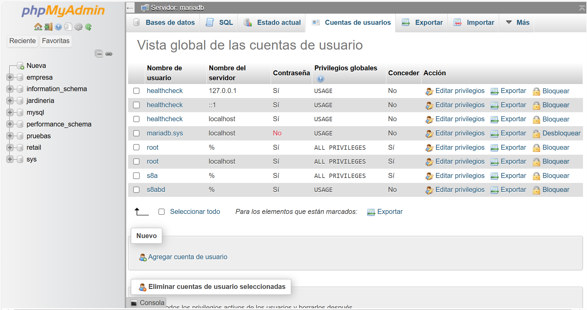

[RA2](tags.md#tag:ra2)
[RA4](tags.md#tag:ra4)
[SQL](tags.md#tag:sql)
[SQL - DCL](tags.md#tag:sql---dcl)
[SQL - TCL](tags.md#tag:sql---tcl)

# SQL - Control de usuarios

## Propuesta didáctica

En esta UT finalizaremos los RA2: **Crea bases de datos definiendo su estructura y las características de sus elementos según el modelo relacional** y RA4: **Modifica la información almacenada en la base de datos utilizando asistentes, herramientas gráficas y el lenguaje de manipulación de datos**.

### Criterios de evaluación

Respecto al RABD.2:

- **CE2g**: Se han creado los usuarios y se les han asignado privilegios.
- **CE2h**: Se han utilizado asistentes, herramientas gráficas y los lenguajes de definición y control de datos.

Respecto al RABD.4:

- **CE4e**: Se ha reconocido el funcionamiento de las transacciones.
- **CE4f**: Se han anulado parcial o totalmente los cambios producidos por una transacción.
- **CE4g**: Se han identificado los efectos de las distintas políticas de bloqueo de registros.
- **CE4h**: Se han adoptado medidas para mantener la integridad y consistencia de la información.

### Contenidos

Bases de datos relacionales:

- Usuarios. Privilegios.
- Lenguaje de control de datos (DCL).

Tratamiento de datos:

- Transacciones.
- Políticas de bloqueo. Concurrencia.

Cuestionario inicial

1. ¿Qué mecanismos de control de acceso implementan los SGBD?
2. ¿Qué sublenguaje de SQL se encarga de gestionar el control de acceso de los usuarios?
3. ¿Cómo podemos crear un usuario en *MariaDB*?
4. A la hora de crear un usuario, ¿Podemos indicar desde qué *hosts* se puede conectar? ¿De qué manera?
5. ¿Qué tipo de permisos se le pueden dar a un usuario sobre un recurso?
6. ¿Qué cláusula es necesaria incluir a la hora de crear un usuario para que el nuevo usuario pueda dar permisos a otros usuarios?
7. ¿Qué sublenguaje de SQL se encarga de gestionar el control de las transacciones?
8. ¿Qué es una transacción en SQL y por qué es importante?
9. ¿Cuáles son los pasos básicos en la ejecución de una transacción?
10. ¿Qué diferencia hay entre los comandos `COMMIT` y `ROLLBACK`?
11. ¿Cuáles son las propiedades ACID y qué garantiza cada una de ellas?
12. ¿Qué efecto tiene activar o desactivar el *autocommit* en un SGBD?
13. Explica la utilidad de los puntos de control (`SAVEPOINT`) en una transacción.
14. ¿Cuáles son los principales problemas de concurrencia que pueden surgir en un SGBD?
15. Explica la diferencia entre una lectura sucia y una lectura no repetible.
16. ¿Qué es el control de concurrencia y qué mecanismos existen para gestionarlo?
17. ¿Cuáles son los niveles de aislamiento de transacciones y qué problemas evitan?
18. ¿Qué tipos de bloqueos se pueden dar en un SGBD? ¿Mediante qué sentencias SQL?

### Programación de Aula (7h)

Esta unidad es la novena, impartiéndose a mitad de la segunda evaluación, a principios de febrero, con una duración estimada de 7 sesiones lectivas:

| Sesión | Contenidos | Actividades | Criterios trabajados |
| --- | --- | --- | --- |
| 1 | DCL. Gestión de [usuarios](#usuarios) | [AC901](#AC901) | CE2g, CE2h |
| 2 | Gestión de [permisos](#permisos) | [AC902](#AC902) | CE2g, CE2h |
| 3 | [Transacciones](#transacciones) |  |  |
| 4 | [Uso](#pasos) de *commit* y *rollback* | [AC904](#AC904) | CE4e, CE4f |
| 5 | [Puntos de parada](#puntos-de-parada) | [AC905](#AC905) | CE4g, CE4h |
| 6 | [Concurrencia](#concurrencia) y [Bloqueos](#bloqueos) | [AC907](#AC907) | CE4e, CE4f, CE4g |
| 7 | [Niveles de aislamiento](#niveles-de-aislamiento) | [AC908](#AC908) | CE4e, CE4f, CE4g, CE4h |

## Seguridad

La seguridad en un SGBD es fundamental para proteger la integridad, confidencialidad y disponibilidad de la información almacenada.

Para ello, se implementan **mecanismos de control de acceso** mediante la gestión de usuarios y la asignación de privilegios. Este control permite definir qué operaciones puede realizar cada usuario o rol sobre los distintos objetos de la base de datos, limitando el acceso a información sensible y previniendo acciones no autorizadas.

En SQL, dentro del DCL, las sentencias como `GRANT` y `REVOKE` permiten otorgar o revocar permisos de acceso y modificación sobre los datos. De esta forma, se establece un entorno seguro donde cada usuario tiene acceso únicamente a los recursos necesarios para sus funciones.

Además del control de acceso, la seguridad de un SGBD también se refuerza mediante el **uso de transacciones y políticas de bloqueo y concurrencia**. Las transacciones garantizan que las operaciones sobre la base de datos se ejecuten de manera atómica, consistente, aislada y duradera (propiedades ACID), lo que previene inconsistencias en caso de errores o fallos del sistema.

Para manejar el acceso concurrente de múltiples usuarios, los SGBD implementan mecanismos de bloqueo que evitan conflictos y garantizan la integridad de los datos. Estos bloqueos, combinados con estrategias de control de concurrencia, aseguran que las transacciones se gestionen de forma ordenada y segura, minimizando riesgos como condiciones de carrera, lecturas sucias o actualizaciones perdidas. Todo esto contribuye a mantener la coherencia y fiabilidad de la base de datos frente a accesos simultáneos y posibles fallos.

### Uso de contraseñas

Independientemente de la gestión de seguridad de los SGBD, las aplicaciones que desarrollemos normalmente utilizarán una base de datos donde se almacene la contraseña de los usuarios. Ni que decir tiene que almacenar las contraseñas en texto plano es un agujero de seguridad, ya que si la base de datos se compromete, las contraseñas de todos los usuarios quedarán expuestas.

Una forma de proteger las contraseñas es almacenarlas encriptadas, de manera que aunque la base de datos se vea comprometida, los atacantes no podrán recuperar las contraseñas originales. Para ello, se emplean algoritmos de encriptación *hash* que generan un valor único e irreversible a partir de la contraseña original.

Un ejemplo de tabla de usuarios con contraseñas encriptadas podría ser la siguiente:

```
CREATE TABLE usuarios (
    id INT AUTO_INCREMENT PRIMARY KEY,
    username VARCHAR(50) UNIQUE NOT NULL,
    email VARCHAR(255) UNIQUE NOT NULL,
    password_hash VARCHAR(255) NOT NULL,
    salt VARCHAR(255),
    created_at TIMESTAMP DEFAULT CURRENT_TIMESTAMP,
    updated_at TIMESTAMP DEFAULT CURRENT_TIMESTAMP ON UPDATE CURRENT_TIMESTAMP,
    esta_activo BOOLEAN DEFAULT TRUE
);
```

Conviene explicar el propósito del campo `salt`. El *salt* es un valor aleatorio único que se añade a cada contraseña antes del proceso de *hashing*. Su propósito es hacer que cada *hash* sea único, incluso para contraseñas idénticas. Mediante su uso, dos usuarios que tengan la misma contraseña tendrán almacenado diferente `password_hash`. Para ello, usaremos primero la función hash [`MD5`](https://mariadb.com/docs/server/reference/sql-functions/secondary-functions/encryption-hashing-and-compression-functions/md5) para crear una cadena aleatoria.

A continuación, cuando insertemos un nuevo usuario, tras concatenar la contraseña con el *salt*, debemos encriptar el resultado mediante la función *hash* [`SHA2`](https://mariadb.com/docs/server/reference/sql-functions/secondary-functions/encryption-hashing-and-compression-functions/sha2):

```
-- Generar salt aleatorio
SET @salt = SUBSTRING(MD5(RAND()) FROM 1 FOR 16);

-- Insertar usuario con hash SHA256 + salt
INSERT INTO usuarios (username, email, password_hash, salt) 
VALUES (
    'usuario1', 
    'user@email.com',
    SHA2(CONCAT('mi_password', @salt), 256),
    @salt
);
```

Por lo tanto, cuando queramos recuperar un usuario que ha hecho *login* en la aplicación, necesitamos volver a concatenar la contraseña con el *salt*, realizar el *hash* y finalmente, comparar las dos cadenas encriptadas:

```
SELECT * FROM usuarios 
WHERE username = 'usuario1' 
AND password_hash = SHA2(CONCAT('mi_password', salt), 256);
```

Dicho esto, los algoritmos *MD5* y *SHA2*, a día de hoy, están obsoletos (se consideran criptográficamente rotos o son fácilmente *hackeables* por fuerza bruta), y por ello, en vez de basarse en las funciones de encriptación que ofrece el SGBD, es mejor hacer uso de los algoritmos [bcrypt](https://en.wikipedia.org/wiki/Bcrypt), [scrypt](https://en.wikipedia.org/wiki/scrypt) o [argon2](https://en.wikipedia.org/wiki/Argon2) desde el lenguaje de programación que utilice el SGBD, ya sea *Java*, *PHP* o *Python*.

## DCL

El *Data Control Language* (DCL - Lenguaje de control de datos) se emplea para gestionar los permisos y privilegios de acceso a los objetos dentro de una base de datos, estableciendo políticas de seguridad que determinan qué usuarios o roles pueden interactuar con los datos y de qué manera.

A través del DCL, los administradores de bases de datos pueden otorgar o revocar permisos, asegurando que cada usuario solo pueda realizar las acciones que le han sido expresamente autorizadas. Este control es esencial para proteger la información sensible, evitar accesos no autorizados y mantener la integridad de los datos.

### Usuarios

Así pues, el primer paso es la creación de usuarios y sus credenciales.

SQL proporciona comandos específicos para crear, modificar y eliminar usuarios, aunque la sintaxis puede variar ligeramente según el SGBD (como *MariaDB*, *PostgreSQL* u *Oracle*).

Para **crear** un nuevo usuario se realiza con la sentencia [CREATE USER](https://mariadb.com/kb/en/create-user/), mediante la sintaxis

```
CREATE USER nombre_usuario IDENTIFIED BY 'contraseña';
```

Al indicar la contraseña, esta se encriptará con un *hash* mediante el algoritmo `mysql_native_password`. El *hash* es irreversible, lo que significa que no se puede recuperar la contraseña original a partir de él.

Además, en *MariaDB*, podemos especificar el *host* desde donde se permite la conexión:

```
CREATE USER 'nombre_usuario'@'localhost' IDENTIFIED BY 'contraseña';
```

Recuerda que cuando empezasteis a usar *MariaDB*, el usuario se creó desde *Docker*, pero podemos crear uno nuevo mediante:

```
CREATE USER s8abd IDENTIFIED BY 's8a';
```

Usuarios existentes

Para averiguar qué usuarios existen en el sistema, en *MariaDB* debemos hacer una consulta sobre la tabla `mysql.user`:

```
select host, user, password from mysql.user;
-- +-----------+-------------+-------------------------------------------+
-- | Host      | User        | Password                                  |
-- +-----------+-------------+-------------------------------------------+
-- | localhost | mariadb.sys |                                           |
-- | localhost | root        | *81F5E21E35407D884A6CD4A731AEBFB6AF209E1B |
-- | 127.0.0.1 | healthcheck | *E6203A3A57998AFD011DDBF30FB411FC065F318C |
-- | ::1       | healthcheck | *E6203A3A57998AFD011DDBF30FB411FC065F318C |
-- | localhost | healthcheck | *E6203A3A57998AFD011DDBF30FB411FC065F318C |
-- | %         | s8a         | *3D3F19386045EE9D580D9527B41DF893A95325B7 |
-- | %         | s8abd       | *3D3F19386045EE9D580D9527B41DF893A95325B7 |
-- +-----------+-------------+-------------------------------------------+
-- 7 rows in set (0.001 sec)
```

La columna `host` indica desde dónde nos podemos conectar a la base de datos, de manera que mediante `root` sólo nos podemos conectar desde la propia máquina (`localhost`), mientras que los usuarios `s8a` y `s8abd` pueden conectarse desde cualquier lugar (`%` hace la función de comodín).

Si hubiéramos querido que nuestro usuario sólo pudiera conectarse desde *localhost* (o cualquier otro *host*), hemos de indicarlo mediante `nombre_usuario@host`:

```
CREATE USER s8abd@localhost IDENTIFIED BY 's8a';
```

Si necesitamos **cambiar** la contraseña o actualizar las propiedades de un usuario existente, utilizaremos la instrucción [`ALTER USER`](https://mariadb.com/kb/en/alter-user/), con la sintaxis:

```
ALTER USER nombre_usuario IDENTIFIED BY 'nueva_contraseña';
```

También se pueden modificar atributos adicionales, como el límite de conexiones o configuraciones de autenticación.

Finalmente, para **eliminar** usuarios utilizaremos la sentencia [`DROP USER`](https://mariadb.com/kb/en/drop-user/), revocando todos sus privilegios y eliminando su acceso a la base de datos.

```
DROP USER nombre_usuario;
```

Es recomendable revocar previamente los permisos asignados para asegurar una gestión ordenada.

### Permisos

Hemos comentado previamente que los usuarios tendrán diferentes permisos sobre los recursos de una base de datos. Para ello, las principales sentencias del DCL son **`GRANT`** y **`REVOKE`**.

La instrucción `GRANT` permite asignar permisos específicos a usuarios o roles, como la capacidad de consultar (`SELECT`), insertar (`INSERT`), actualizar (`UPDATE`) o eliminar (`DELETE`) datos en tablas o vistas. También se pueden otorgar privilegios sobre procedimientos almacenados o esquemas completos.

Por otro lado, la sentencia `REVOKE` se utiliza para retirar esos permisos cuando ya no son necesarios o cuando se detecta un posible riesgo de seguridad.

Además, algunos sistemas permiten incluir la opción **`WITH GRANT OPTION`**, que autoriza a un usuario a conceder los privilegios que ha recibido a otros usuarios. Esta gestión granular de permisos es clave para implementar políticas de seguridad robustas, evitando accesos indebidos y minimizando el riesgo de errores o ataques malintencionados.

Comprobando permisos

¿Cómo puedo saber los permisos que tengo? Para ello, necesitamos ejecutar el comando [`SHOW GRANTS`](https://mariadb.com/kb/en/show-grants/):

```
SHOW GRANTS for CURRENT_USER;
-- +----------------------------------------------------------------------------------------------+
-- | Grants for s8a@%                                                                             |
-- +----------------------------------------------------------------------------------------------+
-- | GRANT ALL PRIVILEGES ON *.* TO `s8a`@`%` IDENTIFIED BY PASSWORD '*3D...B7' WITH GRANT OPTION |
-- | GRANT ALL PRIVILEGES ON `pruebas`.* TO `s8a`@`%`                                             |
-- +----------------------------------------------------------------------------------------------+
-- 2 rows in set (0.001 sec)
```

En cambio, si comprobamos los permisos del usuario que hemos creado en esta sesión:

```
SHOW GRANTS for s8abd;
-- +---------------------------------------------------------------------+
-- | Grants for s8abd@%                                                  |
-- +---------------------------------------------------------------------+
-- | GRANT USAGE ON *.* TO `s8abd`@`%` IDENTIFIED BY PASSWORD '*DF...FD' |
-- +---------------------------------------------------------------------+
-- 1 row in set (0.003 sec)
```

Tras crear un usuario, es necesario asignar permisos mediante el DCL con `GRANT` y retirarlos con `REVOKE`.

#### Otorgando permisos

Así pues, mediante la sentencia [GRANT](https://mariadb.com/kb/en/grant/) daremos privilegios a un usuario sobre uno o más objetos, mediante la siguiente sintaxis:

```
GRANT privilegio ON objeto TO usuario [WITH GRANT OPTION]
```

Los posibles privilegios (los cuales podemos consultar con el comando [`SHOW PRIVILEGES`](https://mariadb.com/kb/en/show-privileges/)) más comunes son:

- `USAGE`: permite que el usuario exista y se conecte, pero sin ningún permiso de acceso a datos.
- `SELECT`: para acceder a tablas o vistas.
- `INSERT[(nombre_columna)]:` Si se especifica el `nombre_columna`, se otorga permiso para insertar en la columna especificada. Si se omite, se permite insertar valores en todas las columnas.
- `UPDATE[(nombre_columna)]`: Lo mismo que `INSERT` para modificar.
- `DELETE`: para eliminar registros de una tabla o vista.
- `GRANT OPTION`: permite dar permisos a otro usuario.
- `ALL`: otorga todos los permisos menos `GRANT OPTION`.

Y para indicar el recurso se emplea la nomenclatura `bd.recurso`, siendo *recurso* una tabla, vista, etc...

Por ejemplo, si nos conectamos con el usuario `s8a` el cual sí que tiene permisos para dar privilegios, podemos hacer:

```
GRANT SELECT, INSERT ON empresa.* TO s8abd;
GRANT SELECT ON retail.customers TO s8abd;
```

Si nos conectamos con ese nuevo usuario, y accedemos a la base de datos de `retail`, podemos ver que sólo puede ver la tabla `customers` :

```
use retail;
show tables;
-- +------------------+
-- | Tables_in_retail |
-- +------------------+
-- | customers        |
-- +------------------+
-- 1 row in set (0.000 sec)
```

Finalmente, si queremos dar permisos de administración a un usuario haremos:

```
GRANT ALL PRIVILEGES ON base_de_datos.* TO nombre_usuario;
```

Si queremos que los usuarios que creamos puedan dar permisos a futuros usuarios, necesitamos indicarlo con `WITH GRANT OPTION`:

```
GRANT ALL PRIVILEGES ON base_de_datos.* TO nombre_usuario WITH GRANT OPTION;
```

Así pues, si quisiéramos crear un nuevo usuario `administrador` que pueda hacer de todo, e incluso dar nuevos permisos, haríamos:

```
CREATE USER administrador@localhost IDENTIFIED BY 'admin';
GRANT ALL PRIVILEGES ON *.* TO administrador@localhost WITH GRANT OPTION;
```

Consejos seguridad

Una gestión adecuada de usuarios implica también definir roles, agrupar permisos y establecer políticas de acceso según los principios de *mínimos privilegios*, donde cada usuario tiene solo los permisos estrictamente necesarios.

#### Quitando permisos

Si en algún momento tenemos que quitarle permisos a un usuario, podemos revocar los privilegios sobre un objeto mediante el comando [`REVOKE`](https://mariadb.com/kb/en/revoke/), con la siguiente sintaxis:

```
REVOKE privilegio ON objeto FROM usuario
```

Así pues, si queremos quitarle el permiso de inserción que antes le habíamos dado al usuario `s8abd` haríamos:

```
REVOKE INSERT ON empresa.* FROM 's8abd';
```

FLUSH PRIVILEGES

El comando `FLUSH PRIVILEGES` se utiliza para recargar los privilegios en memoria después de realizar cambios en las tablas de privilegios del sistema, y los cambios tengan efecto inmediato.

Cuando utilizamos los comandos del DCL (`GRANT`, `REVOKE`, `CREATE USER`, `DROP USER`, `ALTER USER`), *MariaDB* actualiza automáticamente los privilegios en memoria. Por tanto, en un uso normal no es necesario ejecutar `FLUSH PRIVILEGES`.

Sin embargo, si en algún caso modificamos directamente las tablas internas del sistema (como `mysql.user`) mediante sentencias DML, el servidor no detecta el cambio automáticamente. En ese caso, debemos ejecutar:

```
FLUSH PRIVILEGES;
```

### Roles

Si queremos aplicarle los mismos permisos a varios usuarios, podemos hacer uso de los roles. Formalmente, un rol es un conjunto de privilegios que se pueden asignar a uno o más usuarios. Mediante los roles, se simplifica la gestión de permisos, ya que en lugar de asignar privilegios individualmente a cada usuario, se pueden agrupar en un rol y luego asignar ese rol a los usuarios correspondientes.

Para ello, usaremos la sentencia [`CREATE ROLE`](https://mariadb.com/kb/en/create-role/), por ejemplo, para crear un rol desarrollador

```
CREATE ROLE desarrollador;
```

Una vez creado un rol, le daremos permisos mediante `GRANT` o se los quitaremos mediante `REVOKE`, y finalmente le asignaremos el rol a uno o más usuarios mediante `GRANT rol TO usuario`.

```
GRANT ALL ON empresa.* to desarrollador;
GRANT desarrollador to s8abd;
```

Si ahora recuperamos los permisos del usuario `s8abd` veremos que tiene asociado el rol `desarrollador`:

```
SHOW GRANTS for s8abd;
-- +--------------------------------------------------------------------+
-- | Grants for s8abd@%                                                 |
-- +--------------------------------------------------------------------+
-- | GRANT `desarrollador` TO `s8abd`@`%`                               |
-- | GRANT USAGE ON *.* TO `s8abd`@`%` IDENTIFIED BY PASSWORD '*D...FD' |
-- +--------------------------------------------------------------------+
-- 2 rows in set (0.000 sec)
```

Y si recuperamos la info del rol tendremos:

```
SHOW GRANTS for desarrollador;
-- +--------------------------------------------------------+
-- | Grants for desarrollador                               |
-- +--------------------------------------------------------+
-- | GRANT USAGE ON *.* TO `desarrollador`                  |
-- | GRANT ALL PRIVILEGES ON `empresa`.* TO `desarrollador` |
-- +--------------------------------------------------------+
-- 2 rows in set (0.001 sec)
```

En cambio, si queremos quitarle el rol a un usuario, usaremos `REVOKE rol FROM usuario`.

Por último, si queremos eliminar un rol usaremos [`DROP ROLE`](https://mariadb.com/kb/en/drop-role/):

Más información en la [documentación oficial](https://mariadb.com/kb/en/roles_overview/) de *MariaDB*.

### PhpMyAdmin

Si queremos comprobar los usuarios existentes mediante *PhpMyAdmin*, podemos entrar a la opción *Cuentas de usuario* y crear, modificar o eliminar los usuarios del sistema.



Cuentas de usuario en PhpMyAdmin

## Transacciones

Una transacción SQL es un conjunto de sentencias SQL que se ejecutan de forma indivisible (atómica), como si fueran una única operación. El uso de las transacciones es esencial para mantener la integridad de los datos.

Los pasos a la hora de realizar una transacción se resumen en:

1. Iniciar la transacción
2. Realizar las operaciones
3. Finalizar la transacción
4. Confirmar el resultado

```
sequenceDiagram
    autonumber
    Usuario->>BD: Inicia TX
    Usuario->>BD: Realiza operaciones
    Usuario->>BD: Finaliza TX
    BD-->>Usuario: Confirma
```

Para finalizar las transacciones, podemos hacerlo mediante:

- [`COMMIT`](https://mariadb.com/kb/en/commit/): aceptamos todos los cambios
- [`ROLLBACK`](https://mariadb.com/kb/en/rollback/): deshacemos las operaciones
- Un comando DDL, DCL, al finalizar una sesión de trabajo o al producirse un fallo o caída del sistema.

La gestión de transacciones forma parte del sublenguaje TCL (*Transaction Control Language*), el cual incluye los comandos `COMMIT`, `ROLLBACK` y [`SAVEPOINT`](https://mariadb.com/kb/en/savepoint/).

En cuanto a los SGBD, la gran mayoría de los sistemas existentes en el mercado ofrece soporte transaccional, con diferentes políticas de bloqueo. Por ejemplo, *MariaDB* sólo permite realizar transacciones con el motor de almacenamiento *InnoDB*.

Pese a realizar las operaciones de forma segura, el uso de TCL implica un procesamiento adicional que penaliza el rendimiento.

### ACID

Todo SGBD que se considera transaccional debe cumplir con las propiedades ACID:

- **A**tomicidad: La transacción es indivisible. Esto quiere decir que o se ejecutan todas las sentencias o no se ejecuta ninguna.
- **C**onsistencia: Después de una transacción, la base de datos estará en un estado válido y consistente.
- Aislamiento (***I**solation*): Cada transacción accede a los datos de forma aislada, de modo que si una transacción necesita acceder a datos que otra está usando, deberá esperar a que esta termine. Es decir, si una transacción quiere acceder de forma concurrente a los datos que están siendo utilizados por otra transacción, no podrá hacerlo hasta que la primera haya terminado.
- **D**urabilidad: Los cambios que realiza una transacción sobre la base de datos son permanentes.

### Autocommit

Por defecto, los SGBD tienen activo el modo [`autocommit`](https://mariadb.com/kb/en/server-system-variables/#autocommit), indicando que se aceptan automáticamente todos los cambios realizados y no es posible deshacerlos. De esta manera, cada operación individual se considera una transacción.

Para consultar el nivel del *autocommit*, necesitamos realizar una consulta sobre la propiedad `@@AUTOCOMMIT`

```
SELECT @@AUTOCOMMIT;
```

Para desactivarlo, le asignamos el valor 0:

```
SET AUTOCOMMIT = 0;
```

Al desactivarlo tendremos una transacción abierta. Los cambios sólo se aplicarían ejecutando la sentencia `COMMIT` de forma explícita, o cancelaremos la transacción mediante `ROLLBACK`.

Si necesitamos volver a activarlo, le asignamos el valor 1:

```
SET AUTOCOMMIT = 1;
```

### Pasos

Aunque el *autocommit* esté activo, es posible realizar transacciones explícitas, y realmente, es la forma recomendada de trabajar, ya que nos permite controlar mejor el proceso. Para ello, para realizar una [transacción](https://mariadb.com/kb/es/start-transaction/), tal como hemos visto previamente, el primer paso es iniciarla y ejecutar una serie de operaciones:

1. Indicar que vamos a realizar una transacción con la sentencia `START TRANSACTION` ( o`BEGIN`, `BEGIN WORK`, que siendo comandos equivalentes, se mantienen por compatibilidad con otros sistemas como *PostgreSQL*). Al iniciar la transacción, el `AUTOCOMMIT` se deshabilita automáticamente.
2. Realizar las operaciones de manipulación de datos sobre la base datos (insertar, actualizar o borrar filas).
3. Dos posibilidades:

   1. Si las operaciones se han completado y queremos que los cambios se apliquen de forma permanente → `COMMIT`

      ```
      ---
      config:
          look: handDrawn
      ---
      flowchart LR
          A([Estado inicial]) --> B[START TRANSACTION]
          B --> C{{Sentencia SQL 1}}
          C --> D{{Sentencia SQL 2}}
          D --> E[COMMIT]
          E --> F([Estado final])
      ```
   2. Si durante las operaciones ocurre algún error y no queremos aplicar los cambios realizados, podemos deshacerlos → `ROLLBACK`. Al hacer *rollback* se abandona la transacción y se cancelan todos los cambios realizados previamente por la transacción, volviendo al estado inicial previo al inicio de la transacción.

      ```
      ---
      config:
          look: handDrawn
      ---
      flowchart LR
          A([Estado inicial]) --> B[START TRANSACTION]
          B --> C{{Sentencia SQL 1}}
          C --> D{{Sentencia SQL 2}}
          D --> E[ROLLBACK]
          E --> A
      ```

Veamos un ejemplo donde creamos una base de datos `pruebas`, junto a una tabla `cliente`:

```
DROP DATABASE IF EXISTS pruebas;
CREATE DATABASE pruebas CHARACTER SET utf8mb4;
USE pruebas;

CREATE TABLE cliente (
    id INT UNSIGNED PRIMARY KEY,
    nombre VARCHAR (32),
    ciudad VARCHAR (32)
);
```

A continuación, podemos realizar diferentes operaciones dentro de una única transacción:

```
START TRANSACTION;
INSERT INTO cliente VALUES (1, 'Andreu', 'Badajoz');
INSERT INTO cliente VALUES (2, 'Marina', 'Badajoz');
INSERT INTO cliente VALUES (33, 'Pedro', 'Badajoz');
DELETE FROM cliente WHERE nombre = 'Andreu';
COMMIT;
```

De esta manera, las tres inserciones y el borrado se ejecutan como una única operación. Si abrimos dos terminales y entramos con dos sesiones diferentes, y ejecutamos el siguiente flujo, obtendremos:

| Usuario 1 | Resultado 1 | Usuario 2 | Resultado 2 |
| --- | --- | --- | --- |
| `START TRANSACTION;` `INSERT INTO cliente VALUES (1, 'Andreu', 'Badajoz');` `INSERT INTO cliente VALUES (2, 'Marina', 'Badajoz');` |  |  |  |
| `SELECT * FROM CLIENTE;` | `1, Andreu, Badajoz` `2, Marina, Badajoz` | `SELECT * FROM CLIENTE;` | - |
| `INSERT INTO cliente VALUES (33, 'Pedro', 'Badajoz');` `DELETE FROM cliente WHERE nombre = 'Andreu';` `COMMIT;` |  |  |  |
| `SELECT * FROM CLIENTE;` | `2, Marina, Badajoz` `33, Pedro, Badajoz` | `SELECT * FROM CLIENTE;` | `2, Marina, Badajoz` `33, Pedro, Badajoz` |

Autoevaluación

Si en cambio ejecutásemos el siguiente fragmento, tras haber acabado de crear la tabla:

```
START TRANSACTION;
INSERT INTO cliente VALUES (1, 'Andreu', 'Badajoz');
COMMIT;
SET AUTOCOMMIT=0;
INSERT INTO cliente VALUES (2, 'Marina', 'Badajoz');
INSERT INTO cliente VALUES (33, 'Pedro', 'Badajoz');
DELETE FROM cliente WHERE nombre = 'Andreu';
```

1. ¿Qué contendría la tabla `cliente`? [1](#fn:1)
2. Y si tras hacer el borrado, ejecutamos `ROLLBACK` ¿Qué contendrá ahora la tabla? [2](#fn:2)

### Puntos de parada

Los puntos de parada definen puntos de control intermedios dentro de una transacción, de forma que si se efectúa `ROLLBACK` éste pueda ser total (toda la transacción) o hasta uno de los puntos de control de la transacción.

Para ello, primero los definiremos mediante la etiqueta [`SAVEPOINT`](https://mariadb.com/kb/en/savepoint/) dentro de una transacción.

Posteriormente, al ocurrir un error, podemos indicar que realice un `ROLLBACK TO [SAVEPOINT] etiqueta`, deshaciendo sólo las instrucciones que se han ejecutado hasta el punto de parada indicado.

Si queremos eliminar un punto de parada, necesitaremos hacerlo mediante `RELEASE SAVEPOINT etiqueta`

```
START TRANSACTION;
INSERT INTO cliente VALUES(1, 'José Manuel', 'Badajoz');
SAVEPOINT P1;
INSERT INTO cliente VALUES(2, 'Marina', 'Badajoz');
SAVEPOINT P2;
INSERT INTO cliente VALUES(3, 'Andreu', 'Badajoz');

-- Recuperamos los clientes que acabamos de insertar
SELECT * FROM cliente;
ROLLBACK TO P1;         -- Deshace los insert de Marina y Andreu
SELECT * FROM cliente;  -- Mostrará solo José Manuel
ROLLBACK TO P2;         -- Dará error porque al haber hecho ROLLBACK a un punto de control anterior desaparece P2
COMMIT;                 -- Sólo quedará guardado José Manuel
```

## Concurrencia

En el contexto de bases de datos, el término concurrencia se refiere a la capacidad de un sistema de bases de datos para permitir que múltiples usuarios o procesos accedan y manipulen los datos al mismo tiempo, sin que esto afecte a la integridad, consistencia o el rendimiento del sistema.

Cuando se utilizan transacciones, pueden darse problemas de concurrencia en el acceso a los datos, es decir, problemas ocasionados por el acceso al mismo dato de dos transacciones distintas. Cuando diferentes usuarios realizan cambios en el mismo recurso de una base de datos al mismo tiempo se produce un bloqueo.

Un caso de uso muy común es la compra de entradas para eventos (cine, teatro, conciertos,...) donde en un primer paso se selecciona el asiento y posteriormente se realiza la operación. Cuando un usuario selecciona un asiento, éste se bloquea para que ningún usuario pueda adquirirlo, pero ¿y si dos usuarios seleccionan el mismo asiento, pero uno es más rápido que el otro a la hora de confirmar la compra?

Pensemos en otro ejemplo. Cuando realizamos un *bizum* o una transferencia bancaria entre dos usuarios, la cantidad se resta de la cuenta bancaria de origen y se suma en la de destino. Entre una operación y otra pueden pasar muchas cosas ¿Y si se va la luz? ¿Y si el usuario origen no tiene saldo? ¿Restamos y luego sumamos?

La gestión de la concurrencia es un equilibrio entre garantizar la seguridad de los datos y maximizar el rendimiento del sistema.

### Tipos de problemas

Cuando consultamos una base de datos, cada transacción ve una instantánea de los datos, es decir, una versión de la base de datos, sin tener en cuenta el estado actual de los datos que hay por debajo. Así se evita que la transacción vea datos inconsistentes producidos por la actualización de otra transacción concurrente, proporcionando aislamiento transaccional para cada sesión de la base de datos.

Cuando no tenemos control de concurrencia, se pueden producir condiciones de carrera al perder información en una actualización:

- **Condición de carrera** (*Lost Update*) : Se producen errores o inconsistencias cuando dos procesos intentan modificar los mismos datos simultáneamente.

  El usuario 1 comprueba los asientos disponibles, y también lo hace el usuario 2. Ambos ven que el asiento 33 está libre, y al mismo tiempo, inician el proceso de reserva.

  La operación que llega al sistema primero se ejecuta, pero como no hay control de concurrencia, la segunda operación también se ejecuta, sobrescribiendo el resultado de la primera, y de ahí el término 'condición de carrera'.

  | Usuario 1 | Usuario 2 |
  | --- | --- |
  | `SELECT estado FROM asientos WHERE num = 33;` |  |
  |  | `SELECT estado FROM asientos WHERE num = 33;` |
  | `UPDATE asientos SET estado = "ocupado" WHERE num = 33 and usuario = 1;` | `UPDATE asientos SET estado = "ocupado" WHERE num = 33 and usuario = 2;` |

  La solución es introducir transacciones e incluir la lectura dentro de la transacción.

Si introducimos transacciones para evitar las condiciones de carrera, aparecen otro tipo de problemas:

- Lectura no repetible
- Lectura sucia
- Lectura fantasma

- **Lectura No Repetible** (*Non-Repeatable Read*): Se produce cuando en una transacción se consulta el mismo dato dos veces, y la segunda vez encuentra que el valor del dato ha sido modificado por otra transacción.

  El usuario 1 consulta el estado de los asientos y comprueba que el asiento 33 está libre. Mientras tanto el usuario 2, reserva dicho asiento, y cuando el usuario 1 vuelve a confirmar el asiento para realiza la reserva le aparece que está ocupado.

  | Usuario 1 | Usuario 2 |
  | --- | --- |
  | `SELECT estado FROM asientos WHERE num = 33;` |  |
  |  | `UPDATE asientos SET estado = "ocupado" WHERE num = 33;` `COMMIT;` |
  | `SELECT estado FROM asientos WHERE num = 33;` |  |

- **Lectura sucia** (*Dirty Read*). Sucede cuando una segunda transacción lee datos que están siendo modificados por una transacción antes de que haga COMMIT.

  El usuario 1 reserva el asiento, que queda marcado como ocupado, pero sin realizar el `COMMIT`. El usuario 2 comprueba su estado y aparece como ocupado, y tras ello, el usuario 1 cancela la reserva, liberando un asiento que realmente no ha llegado a estar ocupado.

  | Usuario 1 | Usuario 2 |
  | --- | --- |
  | `UPDATE asientos SET estado = "ocupado" WHERE num = 33;` |  |
  |  | `SELECT estado FROM asientos WHERE num = 33;` |
  | `ROLLBACK;` |  |

- **Lectura fantasma** (*Phantom Read*): Se trata de una variación de lecturas no repetibles. Este error ocurre cuando una transacción ejecuta dos veces una consulta que devuelve un conjunto de filas y en la segunda ejecución de la consulta aparecen/desaparecen nuevas filas en el conjunto que no existían cuando se inició la transacción.

  El usuario 1 comprueba los asientos disponibles. A la vez, el usuario 2 elimina el asiento 33 ya que se ha roto y no debe aparecer entre los asientos existentes. Cuando el usuario 1 vuelve a comprobar los asientos existentes, comprueba su estado y el asiento no aparece, cuando antes sí aparecía (de ahí que sea una lectura fantasma).

  | Usuario 1 | Usuario 2 |
  | --- | --- |
  | `SELECT num FROM asientos WHERE estado = "libre";` |  |
  |  | `DELETE FROM asientos WHERE num = 33;` `COMMIT;` |
  | `SELECT num FROM asientos WHERE estado = "libre";` |  |

### Mecanismos

Los sistemas gestores de bases de datos (SGBD) implementan diferentes técnicas para garantizar la consistencia y aislamiento de las transacciones:

- Control de concurrencia mediante **bloqueos** (*Locks*). Los bloqueos son mecanismos que previenen conflictos entre las transacciones que acceden a los mismos recursos, bien sea a estructuras de datos compartidas o a un registro del diccionario de datos.
- **Versionado de datos** (MVCC, *Multi-Version Concurrency Control*): Permite que cada transacción trabaje con su propia copia de los datos, evitando bloqueos y mejorando el rendimiento en sistemas con alta concurrencia. Cuando hay una modificación de datos, en lugar de sobrescribir una fila en actualizaciones, se almacena una nueva versión de la fila mientras se mantiene la versión anterior hasta que ya no sea necesaria (las transacciones que la usan han finalizado). Las versiones anteriores de una fila se almacenan en el espacio de "deshacer" (undo space) para permitir transacciones y lecturas consistentes.
- Protocolos de **serialización**: Garantizan que las transacciones se ejecuten de manera que los resultados sean equivalentes a ejecutarlas en secuencia, evitando interferencias.
- **Niveles de aislamiento**: Establecen reglas sobre cómo se gestionan las interacciones entre transacciones (`READ UNCOMMITTED`, `READ COMMITTED`, `REPEATABLE READ`, `SERIALIZABLE`) para dar solución a los problemas de concurrencia comentados anteriormente.

#### Bloqueos

Cuando un SGBD aísla las transacciones de usuario, utiliza los bloqueos para restringir el acceso de otros usuarios a dichos datos.

Los bloqueos pueden ser:

- **Compartidos** (*Shared*): Permiten que varios procesos lean los mismos datos, pero no los modifiquen. Múltiples usuarios leyendo datos pueden compartirlos, manteniendo bloqueos para prevenir accesos concurrentes por una escritura.
- **Exclusivos** (*Exclusive*): Restringen el acceso a los datos a un solo proceso para lecturas y escrituras. La primera transacción que bloquea el recurso es la única que puede alterarlo hasta liberar el bloqueo.

Cuando se produce una condición de carrera, dependiendo del nivel de aislamiento, el SGBD actuará de una manera u otra, lo que impacta directamente en el rendimiento y la cantidad de bloqueos necesarios.

Si retomamos el ejemplo de los clientes y tenemos dos usuarios que trabajan sobre los mismos datos, y un usuario en una transacción modifica un registro, y no termina de hacer commit ni rollback, cuando un segundo usuario intenta acceder al mismo registro, se producirá un bloqueo:

| Usuario 1 | Usuario 2 |
| --- | --- |
| `INSERT INTO cliente VALUES (1, 'José Manuel', 'Badajoz');`  `INSERT INTO cliente VALUES (2, 'Marina', 'Badajoz');` |  |
| `START TRANSACTION;`  `DELETE FROM cliente WHERE nombre = 'Marina';` |  |
| `SELECT * FROM cliente;` Sólo aparece `José Manuel` |  |
|  | `UPDATE cliente SET ciudad = "El Verger" WHERE nombre = 'Marina';` |

En este punto el usuario 2 se queda *colgado* esperando a que se resuelva la transacción del usuario 1. Finalmente obtendrá un error tras un tiempo de espera:

```
ERROR 1205 (HY000): Lock wait timeout exceeded; try restarting transaction
```

A medida que ajustamos el comportamiento del SGBD como el idóneo para nuestro negocio, podremos llegar a un estado donde el número de bloqueos necesario aumenta, y por lo tanto, disminuye la concurrencia entre los diferentes usuarios, implicando una caída del rendimiento general. En dicho punto, podemos hacer una gestión explícita de los bloqueos o que se encargue el SGBD, pudiendo configurar nosotros los diferentes niveles de aislamiento.

##### Bloqueos explícitos de filas

Este tipo de bloqueos se produce cuando modificamos campos de una fila (o se borran o marcan para ser modificados). El caso de uso más común es cuando necesitamos bloquear un número de filas antes de hacer cambios (como ciertas entradas o asientos). De esta manera, podemos prevenir el conjunto de filas que pueden ser modificadas y asegurarnos que no habrá ningún conflicto con otras transacciones.

Para ello, usaremos la sentencia [`SELECT ... FOR UPDATE`](https://mariadb.com/kb/en/for-update/):

```
START TRANSACTION;
SELECT CodEmp FROM empleado WHERE NumHi = 0 FOR UPDATE;
```

De este modo, se bloquearán todos los empleados sin hijos, y desde otras sesiones si intentan modificar cualquiera de ellos, la transacción se quedará bloqueada hasta que esta termine.

Los bloqueos a nivel de fila no afectan a los datos consultados, únicamente se utilizan para bloquear las escrituras en la misma fila.

##### Bloqueos explícitos de tablas

Cuando el bloqueo automático no es suficiente, y necesitamos tener un mayor control con acceso exclusivo a ciertas tablas y vistas en sesiones paralelas (o concurrentes), es posible bloquear el acceso a las tablas.

El bloqueo de tablas ([`LOCK TABLE`](https://mariadb.com/kb/en/lock-tables/)) protege contra accesos inapropiados de lecturas o escrituras de otras sesiones, impidiendo que otros accesos puedan
cambiar simultáneamente los datos.

La sintaxis es:

```
LOCK TABLE <nombre_tabla> [[as] <alias>] READ | WRITE
[, <nombre_tabla> [[as] <alias>] READ | WRITE ] ...
```

Si indicamos la opción `READ`, va a permitir leer sobre las tablas, pero no escribir. En cambio, la opción `WRITE` permite que la sesión que ejecuta el bloqueo pueda escribir sobre la tabla, pero el resto de sesiones no pueden ni leer ni escribir en esa tabla mientras dure el bloqueo — quedan en espera hasta que se libere con `UNLOCK TABLES.`

Dicho de otro modo:

- `READ`: la sesión que bloquea y todas las demás pueden leer la tabla, pero nadie puede escribir en ella (ni siquiera la sesión que hizo el bloqueo).
- `WRITE`: solo la sesión que bloquea puede leer y escribir. El resto de sesiones no pueden hacer nada con esa tabla (ni leer ni escribir) hasta que se libere el bloqueo.

Por ejemplo, si bloqueamos una tabla, para poder acceder a ella, deberemos hacerlo por su nombre conjuntamente con el alias:

```
LOCK TABLE empleado as empLocked READ;
select * from empleado;
-- ERROR 1100 (HY000): Table 'empleado' was not locked with LOCK TABLES
select * from empleado as empLocked;
-- Muestra el listado de empleados
```

Cuando se ejecuta `LOCK TABLES` se hace un `COMMIT` implícito, por lo tanto, si había alguna transacción abierta, esta acaba. Si la conexión finaliza (normalmente o anormalmente) antes de desbloquear las tablas, automáticamente se desbloquean las tablas.

Otro caso de uso muy común es bloquear todas las tablas de todas las bases de datos del SGBD, para hacer, por ejemplo, copias de seguridad, mediante un [`FLUSH`](https://mariadb.com/kb/en/flush/):

```
FLUSH TABLES WITH READ LOCK;
```

Para desbloquear las tablas (todas las que estuvieran bloqueadas), haremos un [`UNLOCK`](https://mariadb.com/kb/en/transactions-unlock-tables/):

```
UNLOCK TABLES;
```

#### Niveles de aislamiento

Acabamos de estudiar que cuando se trabaja con transacciones, el SGBD puede bloquear conjuntos de datos para evitar o permitir que sucedan estos problemas. Según el nivel de concurrencia que se desee, podemos utilizar cuatro niveles de aislamiento, definiendo cómo los cambios hechos por una transacción son visibles a otras transacciones:

- ***Read Uncommitted*** - `READ UNCOMMITTED` (lectura no confirmada/no acometida/no comprometida). En este nivel no se realiza ningún bloqueo, por lo tanto, permite que sucedan los tres problemas. Todas las consultas se realizan sin bloqueos, de manera que los cambios hechos por una transacción pueden verlos las otras.
- ***Read Committed*** - `READ COMMITTED` (lectura confirmada / acometida / comprometida). En este caso los datos leídos por una transacción pueden ser modificados por otras transacciones, por lo tanto, se pueden dar tanto la lectura no repetible como las lecturas fantasmas.
- ***Repeatable Read*** - `REPEATABLE READ` (lectura repetible). En este nivel ningún registro recuperado mediante un `SELECT` puede modificarlo otra transacción, por lo tanto, sólo pueden ocurrir lecturas fantasmas. Es el nivel de aislamiento por defecto que utiliza *InnoDB*.
- ***Serializable*** - `SERIALIZABLE`. En este caso las transacciones se ejecutan unas detrás de otras, sin que exista la posibilidad de concurrencia, a no ser que el SGBD pueda asegurar que no hay conflicto con el acceso a los datos.

En resumen, los problemas que cubren los diferentes niveles de aislamiento, son:

| Nivel de aislamiento | Lectura fantasma | Lectura no repetible | Lectura sucia | Condición de carrera |
| --- | --- | --- | --- | --- |
| `READ UNCOMMITTED` | - | - | - | 👍 |
| `READ COMMITTED` | - | - | 👍 | 👍 |
| `REPEATABLE READ` | - | 👍 | 👍 | 👍 |
| `SERIALIZABLE` | 👍 | 👍 | 👍 | 👍 |

Para configurar uno u otro nivel, por ejemplo, en *MariaDB*, podemos cambiar el [nivel de aislamiento](https://mariadb.com/kb/en/set-transaction/#isolation-levels) del SGBD en el fichero de configuración con la propiedad `transaction-isolation` (desde *MariaDB* 11.1.1):

```
transaction-isolation = 'READ COMMITTED'
```

También podemos hacerlo para la sesión activa desde el cliente de *MariaDB* mediante [`SET SESSION TRANSACTION`](https://mariadb.com/kb/en/set-transaction/):

```
SET SESSION TRANSACTION ISOLATION LEVEL READ COMMITTED;
```

O para una transacción concreta, antes de iniciar la transacción, mediante [`SET TRANSACTION ISOLATION LEVEL`](https://mariadb.com/kb/en/set-transaction/):

```
SET TRANSACTION ISOLATION LEVEL
    {READ UNCOMMITTED | READ COMMITTED | REPEATABLE READ | SERIALIZABLE}
```

Por ejemplo, podríamos hacer una transacción *serializable* del siguiente modo:

```
SET TRANSACTION ISOLATION LEVEL SERIALIZABLE;
START TRANSACTION;
SELECT CodEmp INTO @jefazo FROM empleado WHERE CodDep = "DIRGE";
UPDATE empleado SET SalEmp = SalEmp * 1.1 WHERE CodEmp = @jefazo;
COMMIT;
```

## Referencias

- Sintaxis SQL oficial de [PostgreSQL](https://www.postgresql.org/docs/current/sql-commands.md) y [MariaDB](https://mariadb.com/kb/en/sql-statements/).
- [Cómo no vender la misma entrada a dos personas diferentes - T3chFest 2023](https://www.youtube.com/watch?v=mNaX4NfsM0c)
- Materiales sobre el módulo de BD:

  - *[Gestió d'usuaris i privilegis](https://ioc.xtec.cat/materials/FP/Recursos/fp_dam_m02_/web/fp_dam_m02_htmlindex/WebContent/u6/a1/continguts.md)* i *[Control de transaccions i concurrencia](https://ioc.xtec.cat/materials/FP/Recursos/fp_dam_m02_/web/fp_dam_m02_htmlindex/WebContent/u5/a3/continguts.md)* - *Institut Obert de Catalunya*.
  - [Lenguaje de control de datos (DCL)](https://josejuansanchez.org/bd/unidad-dcl-sql-teoria/index.md) y [Transacciones](https://josejuansanchez.org/bd/unidad-11-teoria/index.md#transacciones) de *José Juan Sánchez*.
  - [Implementación de bases de datos relacionales / Apartado 12.- Lenguaje de control de datos (DCL).](https://apuntes-daw.javiergutierrez.trade/bases-de-datos/ut3/recopila.md) de *Javier Gutiérrez*.
  - [Seguridad de los datos. DCL](https://gestionbasesdatos.readthedocs.io/es/latest/Tema6/index.md) de gestionbasesdatos.readthedocs.io

## Actividades

- **AC901**. (RABD.2 // CE2g, CE2h // 2p) Sobre la instalación de *MariaDB* que utilizas normalmente, realiza las siguientes operaciones, indicando los comandos necesarios y adjuntando capturas de pantalla de los resultados obtenidos:

  1. Comprueba los usuarios existentes en nuestro SGBD.
  2. Crea un usuario `ac901local` con contraseña `s8a` que sólo pueda conectarse desde `localhost`. Comprueba que puedes acceder con el nuevo usuario.
  3. Crea un usuario `ac901remoto` con contraseña `s8a` que pueda conectarse desde cualquier lugar. Comprueba que puedes acceder con el nuevo usuario.
  4. Modifica la contraseña del usuario `ac901remoto` para que sea `severo`. Comprueba que puedes acceder con la nueva contraseña.
  5. Vuelve a comprobar los usuarios existentes en nuestro SGBD.
  6. Elimina el usuario `ac901remoto`.

- **AC902**. (RABD.2 // CE2g, CE2h // 2p) Sobre la instalación de *MariaDB* que utilizas normalmente, realiza las siguientes operaciones, indicando los comandos necesarios y adjuntando capturas de pantalla de los resultados obtenidos:

  1. Comprueba los permisos del usuario `s8a`.
  2. Sobre el usuario `ac901local`:

     1. Comprueba sus permisos
     2. Asigna los permisos necesarios para que sólo pueda acceder a la tabla `habilidad`, pudiendo hacer consultas, inserciones y borrados, pero no modificaciones sobre los datos.
     3. Comprueba de nuevo los permisos.
  3. Entra al sistema como el usuario `ac901local`, y realiza las siguientes operaciones sobre la tabla `habilidad`:

     1. Insertar una nueva habilidad.
     2. Intenta modificar la nueva habilidad
     3. Elimina la habilidad insertada.
  4. Crea un nuevo usuario `ac902lectura` con contraseña `s8a` que únicamente pueda consultar todas las tablas de la base de datos `empresa`.
  5. Crea un nuevo usuario `ac903todo` con contraseña `s8a` pueda hacer de todo en el sistema, a modo de administrador del sistema.
  6. Entra al sistema como el usuario `ac903todo`, y elimina los usuarios `ac901local` y `ac902lectura`.
  7. Recupera los usuarios existentes en el sistema.

- **AP903**. (RABD.2 // CE2g, CE2h // 3p) Una clínica se pone en contacto con nosotros para que les ayudemos a organizar su sistema de gestión de bases de datos. Actualmente, tienen tres bases de datos: `administracion`, `historiales` y `farmacia`, y necesitan una estructura de permisos adecuada que refleje el siguiente organigrama:

  - `rol_recepcion`: `SELECT` en `administracion.*`, `INSERT` en `administracion.citas`.
  - `rol_medico`: `SELECT`, `UPDATE` en `historiales.*`; `SELECT` en `farmacia.medicamentos`.
  - `rol_farmaceutico`: `SELECT`, `INSERT`, `UPDATE` en `farmacia.*`.
  - `rol_admin_bd`: `ALL` en las tres bases de datos + `WITH GRANT OPTION`.

  Tras crear los roles anteriores, se pide realizar las siguientes tareas, indicando los comandos necesarios y adjuntando capturas de pantalla de los resultados obtenidos:

  1. Crea un usuario por cada rol y asígnaselo. Verifica con `SHOW GRANTS` que todo es correcto.
  2. Crea un nuevo usuario `dr_severo` con contraseña `s8a` y asígnale el rol de médico.
  3. El médico `dr_severo` asciende y necesita también poder insertar en historiales. En lugar de tocar el rol (que afectaría a todos), añade el permiso directamente a su usuario. Comprueba los permisos del médico y analiza cómo conviven permisos de rol y permisos directos.
  4. Por último, el otro médico que creaste previamente, deja la clínica. Desde el departamento TIC nos indican el proceso completo y seguro para revocar accesos:

     1. Quitar el rol.
     2. Verificar que no quedan permisos residuales.
     3. Eliminar el usuario.

- **AC904**. (RABD.4 // CE4e, CE4f // 3p) A partir del siguiente fragmento de código que realiza transacciones, se pide:

  1. Contesta a las preguntas que aparecen como comentarios dentro del código:

     ```
     CREATE TABLE cuentas (
         id INTEGER UNSIGNED PRIMARY KEY,
         saldo DECIMAL(11,2) CHECK (saldo >= 0)
     );

     INSERT INTO cuentas VALUES (1, 1000);
     INSERT INTO cuentas VALUES (2, 2000);
     INSERT INTO cuentas VALUES (3, 0);

     START TRANSACTION;
     UPDATE cuentas SET saldo = saldo - 100 WHERE id = 1;
     UPDATE cuentas SET saldo = saldo + 100 WHERE id = 2;
     COMMIT;
     -- a) ¿Qué contiene cuentas en este momento? Indica los valores concretos de cada registro.

     START TRANSACTION;
     UPDATE cuentas SET saldo = saldo - 100 WHERE id = 9999;
     UPDATE cuentas SET saldo = saldo + 100 WHERE id = 2;
     COMMIT;
     -- b) ¿Qué sucede cuando una cuenta no existe? ¿Se ha modificado el saldo de la cuenta 2?

     START TRANSACTION;
     UPDATE cuentas SET saldo = saldo + 100 WHERE id = 2;
     UPDATE cuentas SET saldo = saldo - 100 WHERE id = 3;
     COMMIT;
     -- c) ¿Y si una cuenta no tiene saldo? ¿Se han modificado ambos saldos? ¿Ninguno? ¿Solo uno? Justifica tu respuesta.
     ```
  2. A continuación, indica las sentencias SQL necesarias para realizar las siguientes tareas dentro de una única operación:

     1. Inserta una nueva cuenta, la 4, con un saldo de 400€.
     2. Inserta la cuenta 5 con un saldo de 500€.
     3. Modifica la cuenta 3 para que su saldo sea 300€.
  3. Y en otra operación:

     1. Inserta la cuenta 6 con un saldo de 600€.
     2. Modifica las cuentas 4 y 5 y quítales 200€ (en una única operación).
     3. Deshaz las dos últimas operaciones.

- **AC905**. (RABD.4 // CE4e, CE4f // 3p) A partir del siguiente fragmento de código que realiza transacciones, sin ejecutar el código, indica el resultado de las consultas realizadas en las líneas 11 y 21, justificando tu respuesta:

  ```
  CREATE TABLE producto (
      id INT UNSIGNED AUTO_INCREMENT PRIMARY KEY,
      nombre VARCHAR(100) NOT NULL,
      precio DOUBLE
  );

  INSERT INTO producto (id, nombre) VALUES (1, 'Primero');
  INSERT INTO producto (id, nombre) VALUES (2, 'Segundo');
  INSERT INTO producto (id, nombre) VALUES (3, 'Tercero');

  SELECT * FROM producto;

  START TRANSACTION;
  INSERT INTO producto (id, nombre) VALUES (4, 'Cuarto');
  SAVEPOINT sp1;
  INSERT INTO producto (id, nombre) VALUES (5, 'Quinto');
  INSERT INTO producto (id, nombre) VALUES (6, 'Sexto');
  ROLLBACK TO sp1;
  COMMIT;

  SELECT * FROM producto;
  ```

  A continuación, indica las sentencias SQL necesarias para realizar las siguientes tareas dentro de una única operación:

  1. Coloca un punto de guardado nombrado `SP2`
  2. Inserta el producto 10 con nombre `Deu` y con 10€ de precio.
  3. Inserta el producto 11 con nombre `Onze` y con 100€ de precio.
  4. Coloca un punto de guardado nombrado `SP3`
  5. Modifica el precio de `Onze` para que sea de 11€.
  6. Cancela las operaciones posteriores a `SP3` y confirma la transacción.
  7. Muestra el resultado de la tabla `producto` y justifica los registros que aparecen.

- **AR906**. (RABD.4 // CE4e // 3p) Analiza el siguiente fragmento de código y piensa si funcionará correctamente, sabiendo que `CodDepDep` es una clave ajena que apunta a `CodDep`:

  ```
  START TRANSACTION;
  INSERT INTO departamento (CodDep, NomDep, CodDepDep) VALUES
      ("TX1", "TX1 apuntará a TX2", "TX2");
  INSERT INTO departamento (CodDep, NomDep, CodDepDep) VALUES
      ("TX2", "TX2 apunta a TX1", "TX1");

  COMMIT;
  ```

  ¿Se ha insertado algún registro? ¿Ambos?

  Y si lo cambiamos por la siguiente transacción ¿Cambia algo?

  ```
  START TRANSACTION;
  INSERT INTO departamento (CodDep, NomDep, CodDepDep) VALUES
      ("TX1", "TX1 apuntará a TX2", NULL);
  INSERT INTO departamento (CodDep, NomDep, CodDepDep) VALUES
      ("TX2", "TX2 apunta a TX1", "TX1");
  UPDATE departamento SET CodDepDep = "TX2" WHERE CodDep = "TX1";
  COMMIT;
  ```

- **AC907**. (RABD.4 // CE4e, CE4f, CE4g, CE4h // 3p) Abre dos sesiones contra el SGBD con dos usuarios distintos (por ejemplo, `s8a` y `root`) en dos terminales. Con uno de ellos, ejecuta las siguientes sentencias:

  ```
  CREATE OR REPLACE TABLE departamento (
      id INT UNSIGNED AUTO_INCREMENT PRIMARY KEY,
      nombre VARCHAR(100) NOT NULL,
      jefe VARCHAR(100));

  INSERT INTO departamento (id, nombre, jefe) VALUES (1, 'Contabilidad', "J1");
  INSERT INTO departamento (id, nombre, jefe) VALUES (2, 'Marketing', "J1");
  INSERT INTO departamento (id, nombre, jefe) VALUES (3, 'I+D', "J2");
  ```

  Inserta el departamento `4` con tu nombre y `J3` como tu jefe.

  A continuación, anota las sentencias necesarias para cada caso y adjunta capturas de pantalla de cada uno de los terminales de los usuarios:

  1. Con el usuario indicado, realiza las siguientes tareas y contesta a las preguntas que se plantean:

     | Usuario 1 | Usuario 2 | Pregunta |
     | --- | --- | --- |
     | Comienza una transacción Consulta la tabla `departamento` |  | ¿Qué datos aparecen y por qué? |
     | Modifica el jefe de *Marketing* para que sea `J2` |  |  |
     |  | Consulta la tabla `departamento` | ¿Qué datos aparecen y por qué? |
     |  | Elimina el departamento de *Marketing* | ¿Qué sucede? |
  2. ¿Qué cambiaría si hubiéramos bloqueado la tabla con accesos de lectura?

     | Usuario 1 | Usuario 2 | Pregunta |
     | --- | --- | --- |
     | Comienza una transacción Bloquea la tabla `departamento` para permitir sólo accesos de lectura Consulta la tabla `departamento` utilizando el bloqueo |  | ¿Qué datos aparecen y por qué? |
     | Modifica el jefe de *Marketing* para que sea `J2` (utilizando el bloqueo) |  | ¿Qué sucede? |
     |  | Consulta la tabla `departamento` | ¿Qué sucede? |
     | Desbloquea la tabla `departamento` |  |  |
  3. ¿Y si la bloqueamos para accesos de escritura?

     | Usuario 1 | Usuario 2 | Pregunta |
     | --- | --- | --- |
     | Comienza una transacción Bloquea la tabla `departamento` para permitir sólo accesos de escritura Consulta la tabla `departamento` utilizando el bloqueo |  | ¿Qué datos aparecen y por qué? |
     | Modifica el jefe de *Marketing* para que sea `J2` (utilizando el bloqueo) |  | ¿Qué sucede? |
     |  | Consulta la tabla `departamento` | ¿Qué sucede? |
     | Desbloquea la tabla `departamento` |  |  |

- **AC908**. (RABD.4 // CE4e, CE4f, CE4g, CE4h // 3p) Abre dos sesiones contra el SGBD con dos usuarios distintos (por ejemplo, `s8a` y `root`) en dos terminales. Con uno de ellos, ejecuta las siguientes sentencias:

  ```
  CREATE TABLE persona (
      id INT UNSIGNED AUTO_INCREMENT PRIMARY KEY,
      nombre VARCHAR(100) NOT NULL);

  INSERT INTO persona (id, nombre) VALUES (1, 'Andreu');
  INSERT INTO persona (id, nombre) VALUES (2, 'Marina');
  ```

  Inserta la persona con el id `3` y tu nombre.

  A continuación, con el usuario indicado, realiza las siguientes tareas y contesta a las preguntas que se plantean:

  | Usuario 1 | Usuario 2 | Pregunta |
  | --- | --- | --- |
  | Comienza una transacción |  |  |
  | Modifica el nombre de `Andreu` por `Andreu 4K`. Consulta la tabla `persona` | Consulta la tabla `persona` |  |
  |  |  | ¿Qué datos aparecen y por qué? |
  |  | Cambia el nivel de aislamiento a *Lectura no confirmada*. (solo para la siguiente transacción) |  |
  |  | Comienza una transacción |  |
  |  | Consulta la tabla `persona` |  |
  |  |  | ¿Qué datos aparecen y por qué? |
  | Anula la sentencia realizada |  |  |
  | Consulta la tabla `persona` | Consulta la tabla `persona` |  |
  |  |  | ¿Qué datos aparecen y por qué? |

  1. ¿Qué tipo de problema de acceso concurrente a los datos se ha producido con el *Usuario 2* al realizar la primera consulta?
  2. ¿Cómo se podría solucionar? Ejecuta otra vez las sentencias anteriores solucionando el problema.

- **AR909**. (RABD.4 // CE4e, CE4f, CE4g, CE4h // 3p) Realiza los ejemplos de los apartados [6.7.1 al 6.7.4](https://josejuansanchez.org/bd/unidad-11-teoria/index.md#niveles-de-aislamiento) de los apuntes del docente *José Juan Sánchez*, adjuntando capturas de las operaciones y contestando a las preguntas que plantea.

- **AP910**. (RABD.4 // CE4e, CE4f, CE4g, CE4h // 3p) Abre dos sesiones contra el SGBD con dos usuarios distintos (por ejemplo, `s8a` y `root`) en dos terminales. Con uno de ellos, ejecuta las siguiente sentencias:

  ```
  CREATE OR REPLACE TABLE departamento (
      id INT UNSIGNED AUTO_INCREMENT PRIMARY KEY,
      nombre VARCHAR(100) NOT NULL,
      jefe VARCHAR(100));

  INSERT INTO departamento (id, nombre, jefe) VALUES (1, 'Contabilidad', "J1");
  INSERT INTO departamento (id, nombre, jefe) VALUES (2, 'Marketing', "J1");
  INSERT INTO departamento (id, nombre, jefe) VALUES (3, 'I+D', "J2");
  ```

  A continuación, con el usuario indicado, realiza las siguientes tareas y contesta a las preguntas que se plantean:

  | Usuario 1 | Usuario 2 | Pregunta |
  | --- | --- | --- |
  | Comprueba el nivel de aislamiento | Comprueba el nivel de aislamiento |  |
  | Si no es *Lectura repetible*, cambiarlo | Si no es *Lectura repetible*, cambiarlo |  |
  | Comienza una transacción |  |  |
  | Modifica el jefe de `Contabilidad` a `J3`. No confirma los datos Consulta la tabla `departamento` |  |  |
  |  | Comienza una transacción |  |
  |  | Consulta la tabla `departamento` |  |
  |  |  | ¿Ve el cambio realizado por el usuario 1? ¿Por qué? |
  |  | Modifica el jefe de `Marketing` a `J4`. No confirma los datos |  |
  |  |  | ¿Ha podido realizar el cambio? ¿Por qué? |
  |  | Modifica el jefe de `Contabilidad` a `J5`. No confirma los datos |  |
  |  |  | ¿Ha podido realizar el cambio? ¿Por qué? |
  |  | Cierra la sesión y vuelve a entrar |  |
  |  | Consulta la tabla `departamento` |  |
  |  |  | ¿Qué ocurre con los cambios realizados por el usuario 2? ¿Por qué? |

- **PR911**. (RABD.2, RABD.4 // CE2g, CE2h, CE4e, CE4f, CE4g, CE4h // 2p RABD.2 + 4p RABD.4) Dado el siguiente DDL sobre un sistema bancario:

  ```
  CREATE DATABASE banco;
  USE banco;

  CREATE TABLE clientes (
      id INT PRIMARY KEY AUTO_INCREMENT,
      nombre VARCHAR(100),
      dni VARCHAR(9) UNIQUE
  );

  CREATE TABLE cuentas (
      id INT PRIMARY KEY AUTO_INCREMENT,
      cliente_id INT,
      iban VARCHAR(24) UNIQUE,
      saldo DECIMAL(12,2) CHECK (saldo >= 0),
      tipo ENUM('corriente','ahorro'),
      FOREIGN KEY (cliente_id) REFERENCES clientes(id)
  );

  CREATE TABLE movimientos (
      id INT PRIMARY KEY AUTO_INCREMENT,
      cuenta_origen INT,
      cuenta_destino INT,
      importe DECIMAL(12,2),
      fecha TIMESTAMP DEFAULT CURRENT_TIMESTAMP,
      estado ENUM('pendiente','completado','anulado') DEFAULT 'pendiente'
  );
  ```

  Se pide, adjuntando los comandos y capturas de pantallas de cada operación, realizar las siguientes tareas:

  1. Crea los siguientes tres usuarios: `cajero` (solo puede hacer `SELECT` e `INSERT` en `movimientos`), `gestor` (`SELECT`, `INSERT`, `UPDATE` en todas las tablas del banco), y `auditor` (solo `SELECT` en todas las tablas).
  2. Crea un rol `empleado_basico` y asígnalo a `cajero`. Comprueba con `SHOW GRANTS` que los permisos son correctos.
  3. Conéctate como `cajero` e intenta borrar un cliente. ¿Qué ocurre? Justifica tu respuesta.
  4. Implementa una transferencia de 500€ de la cuenta 1 a la 2 con el siguiente procedimiento, utilizando transacciones y puntos de guardado:

     - Tras insertar el movimiento con estado pendiente, crear el punto de guardado `sp_movimiento`.
     - Tras restar `saldo` en la cuenta de origen, crear el punto de guardado `sp_resta`.
     - Sumar saldo en la cuenta de destino.
     - Si todo va bien, actualizar el movimiento a `completado` y hacer `COMMIT`.
     - Si falla la suma, por ejemplo, por saldo insuficiente, deshacer la opción al punto de guardado `sp_movimiento` y actualizar el estado a `anulado`.
     - Finaliza la transacción.
  5. Provoca intencionadamente un fallo (por ejemplo, transfieriendo más saldo del disponible). Demuestra que el `SAVEPOINT` funciona correctamente y que el saldo de ambas cuentas queda intacto.
  6. Abre dos sesiones. El *Usuario 1* inicia una transferencia (sin `COMMIT`). El *Usuario 2* intenta hacer otra transferencia sobre la misma cuenta origen. Documenta qué ocurre y cuánto tarda en aparecer el error de *timeout*.
  7. Repite el apartado `f` usando `SELECT ... FOR UPDATE` en la cuenta origen para bloquearla explícitamente. ¿Qué diferencia observas?

- **AR912**. (RABD.2, RABD.4 // CE2g, CE2h, CE4e, CE4f, CE4g, CE4h // 3p) Una vez finalizada la unidad, responde todas las preguntas del cuestionario inicial, con al menos un par de líneas para cada una de las cuestiones.

---

1. Si estamos en la misma sesión, contendrá a `Marina` y a `Pedro`. En cambio, si desde otra sesión comprobamos la tabla, sólo aparecerá `Andreu`, ya que el resto de instrucciones no se han confirmado mediante `COMMIT`. [↩](#fnref:1 "Jump back to footnote 1 in the text")
2. Ahora tanto el usuario local a la transacción como el resto de usuarios sólo verán a `Andreu`. [↩](#fnref:2 "Jump back to footnote 2 in the text")

[](https://ko-fi.com/T6T8GWT9N "Invítame a un café en ko-fi.com")

Gracias por tu tiempo. Si quieres me puedes [invitar a un café en ko-fi](https://ko-fi.com/T6T8GWT9N).

¡Gracias por tu colaboración! Ayúdame a mejorar los apuntes enviándome un mail a [a.medrano@edu.gva.es](mailto:a.medrano@edu.gva.es) con tus comentarios.
