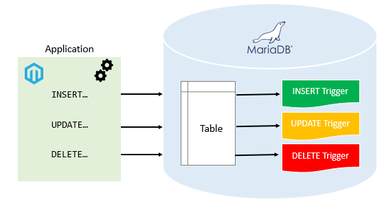
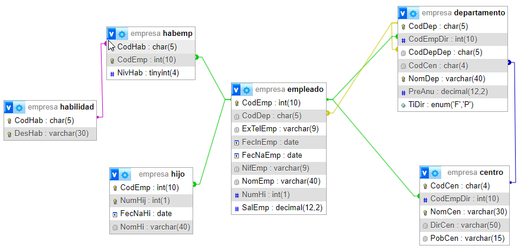
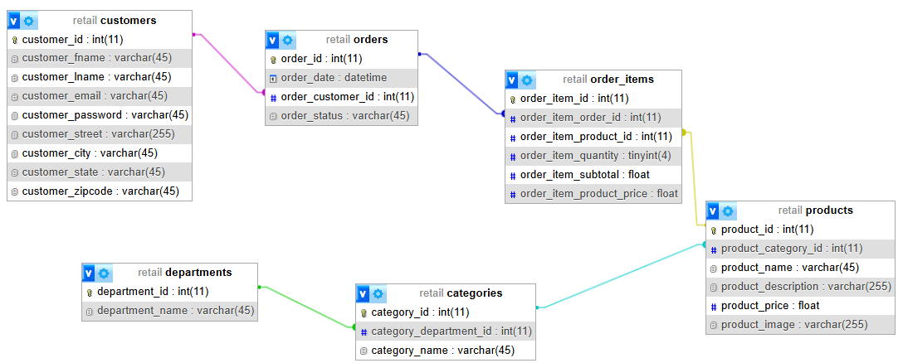

[PL/SQL](tags.md#tag:plsql)
[RA5](tags.md#tag:ra5)
[SQL](tags.md#tag:sql)
[SQL - TCL](tags.md#tag:sql---tcl)

# Disparadores y Cursores

Recordatorio: PL/SQL vs SQL/PSM

Tal como vimos en la [unidad anterior](10plsql.md#lenguajes-de-programacion), a lo largo de estos apuntes empleamos el término *PL/SQL* de forma coloquial, pero lo que realmente escribimos sigue la sintaxis **SQL/PSM** de *MariaDB*.

Esta distinción cobra especial relevancia en esta unidad, ya que **los triggers, la gestión de errores y los cursores son las áreas donde más difieren los dialectos entre SGBD**. Por ejemplo:

- En *Oracle*, los triggers pueden ser `FOR EACH STATEMENT` además de `FOR EACH ROW`; en *MariaDB* solo existe este último.
- El manejo de excepciones en *Oracle* usa un bloque `EXCEPTION ... WHEN` al final del bloque; en *MariaDB* se usa `DECLARE ... HANDLER` al principio.
- Los cursores en *Oracle* admiten cursores implícitos y parámetros; en *MariaDB* son más limitados.

Si en el futuro trabajas con otro SGBD, ten presente que los conceptos (disparador, manejador, cursor) son los mismos, pero la sintaxis cambiará.

## Propuesta didáctica

En esta UT terminaremos de trabajar el RA5: **Desarrolla procedimientos almacenados evaluando y utilizando las sentencias del lenguaje incorporado en el sistema gestor de bases de datos.**

### Criterios de evaluación

- **CE5h**: Se han definido eventos y disparadores.
- **CE5i**: Se han utilizado cursores.
- **CE5j**: Se han utilizado excepciones.

### Contenidos

Programación de bases de datos:

- Eventos y disparadores.
- Excepciones.
- Cursores.

Cuestionario inicial

1. ¿Qué es un evento?
2. ¿Qué es el programador de eventos? ¿Está siempre activo? ¿Cómo puedo comprobarlo?
3. ¿Cómo creo un evento para se ejecute dentro de 5 minutos?
4. ¿Cómo creo un evento que debe comenzar el lunes a las 8:00 y finalizar el viernes a las 17:00 y que se ejecute cada hora?
5. ¿Cómo podemos ver todos los eventos programados actualmente en la base de datos?
6. ¿Qué es un disparador/*trigger*?
7. ¿A qué posibles eventos responde un *trigger*?
8. ¿Puedo lanzar un *trigger* después de otro? ¿Cómo?
9. ¿Cuál es la sintaxis básica para crear un disparador en *MariaDB*?
10. ¿Qué es la gestión de errores en PL/SQL y por qué es importante?
11. ¿Qué palabra clave se utiliza en PL/SQL para manejar excepciones?
12. Hablando de gestión de errores, ¿Para qué sirven las señales?
13. ¿En qué casos es útil relanzar una señal?
14. ¿Cómo se gestionan las transacciones dentro de un PL/SQL?
15. ¿Qué son los cursores en PL/SQL y para qué se utilizan?
16. ¿Cómo se declara un cursor en PL/SQL?
17. ¿Cuáles son los pasos a la hora de utilizar un cursor?

### Programación de Aula (14h)

Esta unidad es la undécima, impartiéndose a mediados de la tercera evaluación, a mitad de marzo, con una duración estimada de 14 sesiones lectivas:

| Sesión | Contenidos | Actividades | Criterios trabajados |
| --- | --- | --- | --- |
| 1 | [Eventos](#eventos) |  |  |
| 2 | Supuesto eventos | [AC1101](#AC1101) | CE5h |
| 3 | [Disparadores](#triggers) | [AC1103](#AC1103) | CE5h |
| 4 | Supuesto disparadores | [AC1104](#AC1104) | CE5h |
| 5 | [Gestión de errores](#gestion-de-errores) | [AC1106](#AC1106) | CE5j |
| 6 | Supuesto errores | [AC1107](#AC1107) | CE5j |
| 7 | [Señales](#uso-de-senales) | [AC1108](#AC1108) | CE5j |
| 8 | [Transacciones](#transacciones-en-plsql) en PL/SQL | [AC1109](#AC1109) | CE5j |
| 9 | [Cursores](#cursores) | [AC1111](#AC1111) | CE5i |
| 10 | Supuesto cursores | [AC1112](#AC1112) | CE5i |
| 11 | Supuesto examen | [AC1113](#AC1113) | RABD.5 |
| 12 | Reto PL/SQL | [PY1114](#PY1114) | RABD.5 |
| 13 | Prueba escrita I | [PO1115](#PO1115) | RABD.5 |
| 14 | Prueba escrita II |  |  |

## Eventos

Un **evento** en *MariaDB* es una tarea programada que se ejecuta de forma automática en momentos específicos o de manera periódica. Funciona de forma similar a un *cron job* en sistemas Linux, permitiendo definir instrucciones SQL que se ejecutarán sin intervención manual, dentro del propio motor de base de datos.

Se utilizan para realizar acciones planificadas, como la actualización de datos, la eliminación de registros obsoletos o la generación de informes en momentos predeterminados. Además, facilitan la automatización del mantenimiento y la administración de la base de datos, ya que centralizan tareas repetitivas en un único punto. Pueden configurarse para ejecutarse una sola vez o en intervalos regulares, brindando flexibilidad para adaptarse a las necesidades específicas del sistema y asegurando que las operaciones críticas se realicen de forma oportuna y consistente.

Para su funcionamiento, es obligatorio que el **programador de eventos esté habilitado**, y si no, hacerlo:

```
-- Verificar estado actual
SHOW VARIABLES LIKE 'event_scheduler';

-- Habilitar el programador de eventos (método 1 - sesión actual)
SET GLOBAL event_scheduler = ON;

-- Habilitar el programador de eventos (método 2 - permanente en my.cnf)
-- Agregar en archivo de configuración:
-- event_scheduler=ON
```

Para comprobar los procesos en ejecución, ejecutaremos [`SHOW PROCESSLIST`](https://mariadb.com/kb/en/show-processlist/):

```
SHOW PROCESSLIST;
-- +----+-----------------+-----------+---------+---------+------+------------------------+------------------+----------+
-- | Id | User            | Host      | db      | Command | Time | State                  | Info             | Progress |
-- +----+-----------------+-----------+---------+---------+------+------------------------+------------------+----------+
-- |  3 | s8a             | localhost | pruebas | Query   |    0 | starting               | show processlist |    0.000 |
-- |  4 | event_scheduler | localhost | NULL    | Daemon  |   51 | Waiting on empty queue | NULL             |    0.000 |
-- +----+-----------------+-----------+---------+---------+------+------------------------+------------------+----------+
-- 2 rows in set (0.001 sec)
```

### Creación de eventos

Para crear un evento usaremos la sentencia [`CREATE EVENT`](https://mariadb.com/kb/en/create-event/), con la siguiente sintaxis:

```
CREATE EVENT nombre_evento
ON SCHEDULE horario
    [ON COMPLETION [NOT] PRESERVE]
    [ENABLE | DISABLE | DISABLE ON SLAVE]
    [COMMENT 'comentario']
DO
  sentencias_sql;

horario:
    AT timestamp [+ INTERVAL intervalo] ... | EVERY intervalo 
    [STARTS timestamp [+ INTERVAL intervalo] ...] 
    [ENDS timestamp [+ INTERVAL intervalo] ...]

intervalo:
    cantidad {YEAR | QUARTER | MONTH | DAY | HOUR | MINUTE |
        WEEK | SECOND | YEAR_MONTH | DAY_HOUR | DAY_MINUTE |
        DAY_SECOND | HOUR_MINUTE | HOUR_SECOND | MINUTE_SECOND}
```

donde:

- `horario`: Define cuándo y con qué frecuencia se ejecuta, pudiendo ser en una fecha concreta (`AT`) o de forma repetida (`EVERY`), definiendo un inicio (`STARTS`) y/o un fin (`ENDS`), incluso detallando el instante temporal desde años a minutos.
- `ON COMPLETION`: Determina si el evento se conserva después de su ejecución
- `ENABLE/DISABLE`: Estado inicial del evento
- `DO`: indica el bloque de código SQL a ejecutar

Preparando

Para probar los eventos, vamos a crear una tabla histórico que admita una fecha y una cadena:

```
CREATE TABLE historico (
    id INT AUTO_INCREMENT PRIMARY KEY,
    fecha DATETIME NOT NULL,
    descripcion VARCHAR(255) NOT NULL
);
```

#### Evento sencillo

Podemos crear eventos que se ejecutan una sola vez, configurando un horario concreto, ya sea un *timestamp* determinado con `AT TIMESTAMP`, o un instante temporal calculado (`CURRENT_TIMESTAMP + INTERVAL ...`).

Evento únicoEvento único calculado

```
CREATE EVENT evento_unico
ON SCHEDULE AT TIMESTAMP '2025-02-27 06:55:00'
DO
    INSERT INTO historico(fecha, descripcion) VALUES (NOW(), 'Evento único ejecutado');
```

```
CREATE EVENT evento_5min
ON SCHEDULE AT CURRENT_TIMESTAMP + INTERVAL 5 MINUTE
DO
    INSERT INTO historico(fecha, descripcion) VALUES (NOW(), 'Evento ejecutado dentro de 5 minutos');
```

#### Evento recurrente

Pero la potencia de los eventos es que se ejecuten de forma periódica. Para ello, en el horario usaremos la cláusula `EVERY` para indicar el intervalo de la repetición:

```
CREATE EVENT evento_recurrente
ON SCHEDULE EVERY 1 DAY
    STARTS '2025-03-01 00:00:00' ENDS '2025-03-31 23:59:59'
DO
    DELETE FROM historico WHERE fecha < DATE_SUB(NOW(), INTERVAL 30 DAY);
```

Además del intervalo de repetición, también podemos indicar una fecha de inicio para comenzar el evento periódico mediante `STARTS`, una fecha de finalización para que termine mediante `ENDS` o utilizar ambos para indicar un periodo determinado:

Recurrente con inicioRecurrente con finalizaciónRecurrente con inicio/fin

```
CREATE EVENT evento_recurrente_con_inicio
ON SCHEDULE EVERY 12 HOUR STARTS '2025-03-01 00:00:00'
DO
    CALL actualizar_inventario();
```

```
CREATE EVENT evento_recurrente_con_fin
ON SCHEDULE EVERY 1 WEEK ENDS '2025-12-31 23:59:59'
DO
    CALL actualizar_inventario();
```

```
CREATE EVENT evento_recurrente_con_inicio_fin
ON SCHEDULE EVERY 36 HOUR STARTS '2025-03-01 00:00:00' ENDS '2025-12-31 23:59:59'
DO
    CALL actualizar_inventario();
```

Eventos y procedimientos

Una buena práctica es encapsular la lógica de los eventos dentro de procedimientos almacenados, para poder probarlos sin necesidad de provocar que se dispare el evento, además de poder reutilizar la lógica entre eventos con periodicidades distintas.

---

Una vez creados los eventos, cuando llegue el momento adecuado, se ejecutarán. En el fichero de log de *MariaDB* (por ejemplo, desde la consola de *Docker Desktop* o en `/var/log/mysql/`) podremos comprobar su ejecución:

```
2025-02-27 17:50:30 2025-02-27 16:50:30 4 [Note] Event Scheduler: scheduler thread started with id 4
2025-02-27 17:55:00 2025-02-27 16:55:00 4 [Note] Event Scheduler: Last execution of pruebas.evento_unico. Dropping.
2025-02-27 17:55:00 2025-02-27 16:55:00 5 [Note] Event Scheduler: Dropping pruebas.evento_unico
2025-02-27 17:57:22 2025-02-27 16:57:22 4 [Note] Event Scheduler: Last execution of pruebas.evento_5min. Dropping.
2025-02-27 17:57:22 2025-02-27 16:57:22 6 [Note] Event Scheduler: Dropping pruebas.evento_5min
```

### Gestión de eventos

Para listar los eventos existentes, usaremos [`SHOW EVENTS`](https://mariadb.com/kb/en/show-events/), donde veremos los eventos que están pendiente de ejecutar:

```
SHOW EVENTS;
-- +---------+-------------------+---------------+-----------+-----------+------------+----------------+----------------+---------------------+---------------------+---------+------------+----------------------+----------------------+-----------------------+
-- | Db      | Name              | Definer       | Time zone | Type      | Execute at | Interval value | Interval field | Starts              | Ends                | Status  | Originator | character_set_client | collation_connection | Database Collation    |
-- +---------+-------------------+---------------+-----------+-----------+------------+----------------+----------------+---------------------+---------------------+---------+------------+----------------------+----------------------+-----------------------+
-- | pruebas | evento_recurrente | s8a@localhost | SYSTEM    | RECURRING | NULL       | 1              | DAY            | 2025-03-01 00:00:00 | 2025-03-31 23:59:59 | ENABLED |          1 | utf8mb3              | utf8mb3_general_ci   | utf8mb4_uca1400_ai_ci |
-- +---------+-------------------+---------------+-----------+-----------+------------+----------------+----------------+---------------------+---------------------+---------+------------+----------------------+----------------------+-----------------------+
-- 1 row in set (0.002 sec)
```

En el caso de querer obtener únicamente los eventos de una base de datos concreta, necesitamos filtrar mediante `SHOW EVENTS FROM nombre_base_datos;`.

Si queremos modificar un evento, ya sea su periodicidad o su código, así como habilitarlos o deshabilitarlos, usaremos la sentencia [`ALTER EVENT`](https://mariadb.com/kb/en/alter-event/):

```
-- Modificar la programación o el código
ALTER EVENT nombre_evento
ON SCHEDULE EVERY 2 DAY
DO
  /* Nuevo código */;

-- Habilitar o deshabilitar un evento
ALTER EVENT nombre_evento ENABLE;
ALTER EVENT nombre_evento DISABLE;
```

Destacar que en ocasiones nos interesará deshabilitar un determinado evento (con la idea de volver a habilitarlo en el futuro), pero en otros eliminarlo completamente. Para ello, usaremos [`DROP EVENT`](https://mariadb.com/kb/en/drop-event/):

```
DROP EVENT nombre_evento;
```

Consideraciones

Cuando un desarrollador se adentra en el mundo de los eventos en *MariaDB*, debe tener en cuenta varias consideraciones importantes para asegurar que estos procesos automatizados funcionen de manera óptima. Ante todo, es fundamental verificar que el *Event Scheduler* esté activado en el sistema. Si se reinicia el servidor, dependiendo de la configuración, puede ser que el programador de eventos esté deshabilitado.

Otro aspecto crucial es el manejo de los errores (lo estudiaremos más adelante en esta unidad) capturando excepciones y registrando la información relevante en tablas de *logs*, ofreciendo mecanismos para monitorizar los eventos en ejecución y cuál ha sido su estado de ejecución, mediante alguna tabla específica que registre información detallada sobre la ejecución de cada evento (incluyendo tiempos, resultados y cualquier anomalía), lo que nos proporcionará una ayuda de un valor incalculable cuando surjan los problemas (que tarde o temprano, sucederán).

Finalmente, siempre deberemos controlar los tiempos de ejecución, para evitar operaciones muy largas, así como evitar solapamientos entre diferentes eventos que sobrescriban la misma información.

## Triggers

Directamente relacionados con los eventos, tenemos los **disparadores** (***triggers***) que son fragmentos de código que se activan automáticamente en respuesta a operaciones específicas sobre las tablas, tales como inserciones, actualizaciones o eliminaciones.

Estos mecanismos permiten inyectar lógica personalizada que se ejecuta antes (*before*) o después (*after*) de que se realice la orden SQL que provoca su ejecución, lo que es fundamental para garantizar la integridad de los datos, validar condiciones de negocio y llevar a cabo auditorías automáticas. Por ejemplo, un disparador puede registrar cada cambio en una tabla de auditoría o prevenir modificaciones que no cumplan con ciertos criterios, asegurando así la consistencia y confiabilidad de la información almacenada.

Los posibles eventos que podemos asociar a un disparador son:

- `INSERT`: El *trigger* se activa cuando se inserta una nueva fila sobre la tabla asociada.
- `UPDATE`: Se activa cuando se actualiza una fila.
- `DELETE`: Se activa cuando se elimina una fila.



Triggers

Si la operación SQL que va a provocar la ejecución del *trigger* afecta a múltiples filas (por ejemplo un borrado de varios registros), el *trigger* se ejecutará una vez por cada fila afectada.

### Creación de disparadores

A la hora de crear un disparador, necesitamos definir:

- Sobre qué tabla se va a aplicar
- Sobre qué operación se va a realizar (`INSERT`, `DELETE`, `UPDATE`)
- Y cuando queremos que se ejecute, antes (`BEFORE`) o después (`AFTER`) de la operación sobre la tabla.

Para ello, usaremos la sentencia [`CREATE TRIGGER`](https://mariadb.com/kb/en/create-trigger/) con la siguiente sintaxis:

```
CREATE [OR REPLACE] TRIGGER nombreTrigger cuandoTrigger eventoTrigger
    ON nombreTabla FOR EACH ROW
    [ordenTrigger]
    cuerpo

cuandoTrigger: { BEFORE | AFTER }
eventoTrigger: { INSERT | UPDATE | DELETE }
ordenTrigger: { FOLLOWS | PRECEDES } otroNombreTrigger
```

Dentro del cuerpo del disparador, vamos a poder acceder a los valores del registro de la tabla anterior y posterior a la orden SQL. Para ello, el alias `NEW` referencia al nuevo registro, y `OLD` al antiguo. Dependiendo de la operación, podremos emplear uno u otro, o los dos:

| Operación | `NEW` | `OLD` |
| --- | --- | --- |
| `UPDATE` | Valores nuevos | Valores antiguos |
| `INSERT` | Valores nuevos | No existe |
| `DELETE` | No existe | Valores antiguos |

Cabe destacar que los *triggers* de tipo `AFTER DELETE` se activan solo cuando realmente se eliminan filas. Si el `DELETE` no afecta a ninguna fila (por ejemplo, porque la condición `WHERE` no coincide con ninguna fila), entonces el trigger no se dispara.

Veamos un ejemplo donde almacenamos las notas de los estudiantes de un curso, y queremos comprobar si al insertar los valores son correctos, y si no lo son, ajustarlos:

```
create or replace table estudiantes (
    id int unsigned auto_increment primary key,
    nombre varchar(50) not null,
    apellidos varchar(50) not null,
    nota float
);

DELIMITER //
CREATE OR REPLACE TRIGGER triggerCheckNotaBeforeInsert
  BEFORE INSERT ON estudiantes FOR EACH ROW
begin
    if NEW.nota < 0 then -- NEW referencia al nuevo registro
        set NEW.nota = 0;
    elseif NEW.nota > 10 then
        set NEW.nota = 10;
    end if;
end
//

DELIMITER ;

insert into estudiantes values (1, 'Andreu', 'Medrano', -1);
insert into estudiantes values (2, 'José Manuel', 'Pérez', 12);
insert into estudiantes values (3, 'Pedro', 'Casas', 8.5);

select * from estudiantes;
-- +----+--------------+-----------+------+
-- | id | nombre       | apellidos | nota |
-- +----+--------------+-----------+------+
-- |  1 | Andreu       | Medrano   |    0 |
-- |  2 | José Manuel  | Pérez     |   10 |
-- |  3 | Pedro        | Casas     |  8.5 |
-- +----+--------------+-----------+------+
-- 3 rows in set (0.000 sec)
```

Podemos comprobar como dentro del cuerpo del disparador hemos usado `NEW` para referenciar el registro que vamos a insertar. Además, hemos configurado el disparador para que se ejecute antes de la inserción.

Nomenclatura

En *MariaDB*, no hay una nomenclatura obligatoria para nombrar los *triggers*, pero se recomienda seguir una convención clara y estructurada para facilitar su identificación y mantenimiento.

Algunas recomendaciones:

1. Usar un prefijo indicativo, como por ejemplo `trg_` o `trigger_`, ya sea usando como separador `_` o una notación *camelCase*.
2. Incluir el nombre de la tabla afectada
3. Especificar el evento que lo dispara, ya sea `BEFORE` o `AFTER` y la operación `INSERT`, `UPDATE` o `DELETE`

Algunos ejemplos podrían ser:

| Nombre del Trigger | Explicación |
| --- | --- |
| `trg_usuarios_before_insert` | Se ejecuta antes de una inserción en `usuarios`. |
| `triggerPedidosAfterUpdate` | Se activa después de actualizar `pedidos`, posiblemente para registrar cambios. |
| `trgProductosBeforeDeleteCascade` | Antes de eliminar en `productos`, quizás para eliminar dependencias. |

De la misma manera, podemos crear un disparador para las operaciones de modificación:

```
DELIMITER //

CREATE OR REPLACE TRIGGER triggerCheckNotaBeforeUpdate
  BEFORE UPDATE ON estudiantes FOR EACH ROW
BEGIN
    if NEW.nota < 0 then -- NEW referencia al nuevo registro
        set NEW.nota = 0;
    elseif NEW.nota > 10 then
        set NEW.nota = 10;
    end if;
end
//

DELIMITER ;

update estudiantes set nota = -4 where id = 1;
update estudiantes set nota = 14 where id = 2;
update estudiantes set nota = 9.5 where id = 3;

select * from estudiantes;
-- +----+--------------+-----------+------+
-- | id | nombre       | apellidos | nota |
-- +----+--------------+-----------+------+
-- |  1 | Andreu       | Medrano   |    0 |
-- |  2 | José Manuel  | Pérez     |   10 |
-- |  3 | Pedro        | Casas     |  9.5 |
-- +----+--------------+-----------+------+
-- 3 rows in set (0.000 sec)
```

Triggers encadenados

Es posible tener más de un *trigger* sobre la misma tabla y con el mismo evento. En estos casos, la ejecución se hará uno después de otro en el orden en que fueron creados.

Si queremos modificar dicho orden, a la hora de crear el trigger tendremos que utilizar la opción `ordenTrigger: { FOLLOWS | PRECEDES } otroNombreTrigger`. De tal forma que el trigger que se está creando se ejecute antes (`PRECEDES`) o después (`FOLLOWS`) que el trigger que ya existe (`otroNombreTrigger`).

Es importante destacar que solo puedes encadenar triggers del mismo evento (`INSERT`, `UPDATE`, `DELETE`) y tiempo (`BEFORE`, `AFTER`).

Supongamos el siguiente ejemplo donde definimos tres disparadores que actúan sobre la misma tabla de `ventas`: el primero que inserta en el log, el segundo que modifica el inventario y por último, el tercero que inserta en la tabla de estadísticas, y que queremos que se realice antes de insertar en el log:

```
-- Primer trigger
CREATE TRIGGER after_insert_ventas_1
AFTER INSERT ON ventas
FOR EACH ROW
BEGIN
    INSERT INTO log_ventas (venta_id, accion) VALUES (NEW.id, 'Nueva venta registrada');
END;

-- Segundo trigger que debe ejecutarse DESPUÉS del primero
CREATE TRIGGER after_insert_ventas_2
AFTER INSERT ON ventas
FOR EACH ROW
    FOLLOWS after_insert_ventas_1
BEGIN
    UPDATE inventario SET cantidad = cantidad - NEW.cantidad WHERE producto_id = NEW.producto_id;
END;

-- Tercer trigger que debe ejecutarse ANTES del primero
CREATE TRIGGER after_insert_ventas_3
AFTER INSERT ON ventas
FOR EACH ROW
    PRECEDES after_insert_ventas_1
BEGIN
    INSERT INTO estadisticas_ventas (fecha, monto) VALUES (CURRENT_DATE(), NEW.monto);
END;
```

Si comprobamos bien las cláusulas `PRECEDES` y `FOLLOWS`, tenemos que el orden de ejecución sería:

1. `after_insert_ventas_3` (porque `PRECEDES` `after_insert_ventas_1`)
2. `after_insert_ventas_1`
3. `after_insert_ventas_2` (porque `FOLLOWS` `after_insert_ventas_1`)

### Gestión de disparadores

Los comandos que podemos utilizar para gestionar los disparadores son:

- [DROP TRIGGER nombreTrigger](https://mariadb.com/kb/en/drop-trigger/): permite eliminar un disparador
- [SHOW TRIGGERS](https://mariadb.com/kb/en/show-triggers/): muestra los disparadores existentes

  ```
  SHOW TRIGGERS;
  -- +------------------------------+--------+-------------+------------------------------------------------------------------------------------------------------------------------+--------+------------------------+-------------------------------------------------------------------------------------------+---------------+----------------------+----------------------+-----------------------+
  -- | Trigger                      | Event  | Table       | Statement                                                                                                              | Timing | Created                | sql_mode                                                                                  | Definer       | character_set_client | collation_connection | Database Collation    |
  -- +------------------------------+--------+-------------+------------------------------------------------------------------------------------------------------------------------+--------+------------------------+-------------------------------------------------------------------------------------------+---------------+----------------------+----------------------+-----------------------+
  -- | triggerCheckNotaBeforeInsert | INSERT | estudiantes | BEGIN
  -- IF NEW.nota < 0 THEN
  --     set NEW.nota = 0;
  -- ELSEIF NEW.nota > 10 THEN
  --     set NEW.nota = 10;
  -- END IF;
  -- END | BEFORE | 2025-02-23 18:32:28.15 | STRICT_TRANS_TABLES,ERROR_FOR_DIVISION_BY_ZERO,NO_AUTO_CREATE_USER,NO_ENGINE_SUBSTITUTION | s8a@localhost | utf8mb3              | utf8mb3_general_ci   | utf8mb4_uca1400_ai_ci |
  -- | triggerCheckNotaBeforeUpdate | UPDATE | estudiantes | BEGIN
  -- IF NEW.nota < 0 THEN
  --     set NEW.nota = 0;
  -- ELSEIF NEW.nota > 10 THEN
  --     set NEW.nota = 10;
  -- END IF;
  -- END    | BEFORE | 2025-02-23 18:36:51.74 | STRICT_TRANS_TABLES,ERROR_FOR_DIVISION_BY_ZERO,NO_AUTO_CREATE_USER,NO_ENGINE_SUBSTITUTION | s8a@localhost | utf8mb3              | utf8mb3_general_ci   | utf8mb4_uca1400_ai_ci |
  -- +------------------------------+--------+-------------+------------------------------------------------------------------------------------------------------------------------+--------+------------------------+-------------------------------------------------------------------------------------------+---------------+----------------------+----------------------+-----------------------+
  -- 2 rows in set (0.003 sec)
  ```

  ---

  Además de `SHOW TRIGGERS`, podemos consultar la tabla del catálogo [`information_schema.TRIGGERS`](https://mariadb.com/kb/en/information-schema-triggers-table/) para obtener información más detallada o filtrada:

  ```
  -- Triggers de la tabla estudiantes
  SELECT TRIGGER_NAME, EVENT_MANIPULATION, ACTION_TIMING
  FROM information_schema.TRIGGERS
  WHERE TRIGGER_SCHEMA = 'pruebas'
  AND EVENT_OBJECT_TABLE = 'estudiantes';
  -- +------------------------------+--------------------+---------------+
  -- | TRIGGER_NAME                 | EVENT_MANIPULATION | ACTION_TIMING |
  -- +------------------------------+--------------------+---------------+
  -- | triggerCheckNotaBeforeInsert | INSERT             | BEFORE        |
  -- | triggerCheckNotaBeforeUpdate | UPDATE             | BEFORE        |
  -- +------------------------------+--------------------+---------------+

  -- Todos los triggers BEFORE de la base de datos actual
  SELECT TRIGGER_NAME, EVENT_OBJECT_TABLE, EVENT_MANIPULATION
  FROM information_schema.TRIGGERS
  WHERE TRIGGER_SCHEMA = DATABASE()
  AND ACTION_TIMING = 'BEFORE';
  ```

  Esta tabla resulta especialmente útil cuando necesitamos comprobar la existencia de un *trigger* desde un procedimiento almacenado o generar documentación automática del esquema.
- [SHOW CREATE TRIGGER nombreTrigger](https://mariadb.com/kb/en/show-create-trigger/): muestra el código fuente de un determinado disparador

  ```
  SHOW CREATE TRIGGER triggerCheckNotaBeforeUpdate;
  -- +------------------------------+-------------------------------------------------------------------------------------------+------------------------------------------------------------------------------------------------------------------------------------------------------------------------------------------------------------------------------------+----------------------+----------------------+-----------------------+------------------------+
  -- | Trigger                      | sql_mode                                                                                  | SQL Original Statement                                                                                                                                                                                                             | character_set_client | collation_connection | Database Collation    | Created                |
  -- +------------------------------+-------------------------------------------------------------------------------------------+------------------------------------------------------------------------------------------------------------------------------------------------------------------------------------------------------------------------------------+----------------------+----------------------+-----------------------+------------------------+
  -- | triggerCheckNotaBeforeUpdate | STRICT_TRANS_TABLES,ERROR_FOR_DIVISION_BY_ZERO,NO_AUTO_CREATE_USER,NO_ENGINE_SUBSTITUTION | CREATE DEFINER=`s8a`@`localhost` TRIGGER triggerCheckNotaBeforeUpdate
  -- BEFORE UPDATE ON estudiantes FOR EACH ROW
  -- BEGIN
  -- IF NEW.nota < 0 THEN
  --     set NEW.nota = 0;
  -- ELSEIF NEW.nota > 10 THEN
  --     set NEW.nota = 10;
  -- END IF;
  -- END | utf8mb3              | utf8mb3_general_ci   | utf8mb4_uca1400_ai_ci | 2025-02-23 18:36:51.74 |
  -- +------------------------------+-------------------------------------------------------------------------------------------+------------------------------------------------------------------------------------------------------------------------------------------------------------------------------------------------------------------------------------+----------------------+----------------------+-----------------------+------------------------+
  ```

  Si queremos obtener el código de todos los disparadores, podríamos usar un `SHOW CREATE TRIGGER` para cada uno de ellos, o bien, como alternativa más potente a `SHOW TRIGGERS`, también podemos realizar una consulta a `INFORMATION_SCHEMA.TRIGGERS`.

De estas operaciones podemos deducir que los disparadores no se pueden modificar; es necesario borrarlos y volverlos a crear.

### Consideraciones

Al igual que con los eventos, a la hora de programar disparadores, es fundamental tener en cuenta una serie de consideraciones.

Respecto a la **gestión de errores**, debemos distinguir entre dos situaciones: los errores que queremos que detengan la operación (por ejemplo, un `SIGNAL` que impide una inserción que no cumple una regla de negocio) y los errores inesperados que conviene registrar sin enmascarar. Para el segundo caso, es recomendable utilizar manejadores que registren la información relevante en una tabla de *logs*.

Además, debemos tener en cuenta las siguientes **limitaciones**:

- Dentro de un *trigger* no se pueden usar transacciones, es decir, ni `COMMIT`, `ROLLBACK` ni `START TRANSACTION`. Tampoco se puede invocar a procedimientos que contengan transacciones. Si un *trigger* falla, *MariaDB* deshace automáticamente la operación que lo activó.
- Un *trigger* no puede modificar la misma tabla que lo disparó, ya que esto provocaría una llamada recursiva. Si necesitamos modificar datos de la propia tabla, debemos hacerlo a través de los alias `NEW` y `OLD` dentro del propio cuerpo del disparador (solo en *triggers* `BEFORE`).
- Si dentro de un *trigger* se ejecutan sentencias DML sobre **otras** tablas, los disparadores asociados a esas tablas sí se activarán (*triggers* en cascada). Hay que tener precaución con las cadenas largas de disparadores, ya que dificultan la depuración y pueden afectar al rendimiento.
- `TRUNCATE` no dispara *triggers*: la sentencia `TRUNCATE TABLE` es una operación DDL, no DML, por lo que no activa los disparadores asociados a `DELETE`.
- No se puede devolver un resultado al cliente: no se permite ejecutar un `SELECT` que devuelva filas. Si necesitamos consultar datos, debemos usar `SELECT ... INTO` para almacenarlos en variables.
- Los procedimientos invocados desde un *trigger* heredan sus restricciones: si un *trigger* llama a un procedimiento mediante `CALL`, dicho procedimiento tampoco podrá usar transacciones ni devolver resultados al cliente.

  ```
  -- Esto NO funciona dentro de un trigger:
  CREATE TRIGGER trg_ejemplo BEFORE INSERT ON estudiantes FOR EACH ROW
  BEGIN
      -- ✗ Error: no se puede devolver un resultado al cliente
      SELECT * FROM estudiantes WHERE nota > 5;

      -- ✗ Error: tabla mutante
      UPDATE estudiantes SET nota = 0 WHERE id = 1;

      -- ✗ Error: no se permiten transacciones
      START TRANSACTION;
  END;
  ```

Buenas prácticas con triggers

Al igual que con los eventos, conviene tener en cuenta algunas consideraciones a la hora de diseñar y utilizar *triggers*:

- Mantener la lógica breve: un *trigger* se ejecuta **por cada fila afectada**. Si una sentencia `UPDATE` modifica 10.000 filas, el *trigger* se ejecutará 10.000 veces. Un *trigger* pesado (con múltiples consultas o inserciones) puede degradar seriamente el rendimiento.
- Evitar *triggers* en cascada: un *trigger* que modifica otra tabla puede disparar a su vez otro *trigger*, y así sucesivamente. Estas cadenas son difíciles de depurar y pueden provocar comportamientos inesperados. Si la lógica es compleja, es preferible encapsularla en un procedimiento almacenado.
- Documentar su existencia: los *triggers* son "invisibles" para quien ejecuta un simple `INSERT` o `UPDATE`. Un desarrollador que desconoce su existencia puede perder mucho tiempo depurando un comportamiento inesperado. Es recomendable documentar en el propio DDL o en un fichero aparte qué *triggers* existen y qué hacen.
- No sustituir restricciones por *triggers*: si una validación puede expresarse como un `CHECK`, `NOT NULL`, `UNIQUE` o clave ajena, es preferible usar la restricción declarativa. Los *triggers* deben reservarse para validaciones que no se pueden expresar de forma declarativa (reglas de negocio complejas, auditoría, cálculos derivados...).
- Probar con operaciones masivas: muchos *triggers* funcionan correctamente con inserciones individuales pero revelan problemas de rendimiento o lógica cuando se prueban con `INSERT ... SELECT` o `UPDATE` sin `WHERE` restrictivo.

## Gestión de Errores

Hasta ahora hemos supuesto que nuestros fragmentos de código nunca fallan. Pero ¿qué sucede cuando un procedimiento o un evento tienen un error? Ya sea porque no encuentra una tabla, accedemos erróneamente a un campo que no existe, etc..

Una gestión de errores efectiva en *MariaDB* mejora significativamente la robustez y mantenibilidad de las aplicaciones. Para ello, *MariaDB* ofrece varios mecanismos para la gestión de errores, que incluyen señales, manejadores, códigos de error y excepciones, que permiten:

- Controlar el flujo de ejecución ante situaciones excepcionales.
- Proporcionar retroalimentación clara a los usuarios y desarrolladores.
- Mantener la integridad de los datos mediante transacciones.
- Implementar reglas de negocio complejas.

A la hora de programar desde el punto de vista del gestor, por medio de procedimientos/funciones, podemos realizar dos aproximaciones diferentes a la gestión de errores (incluso una combinación de las dos):

- Capturar las excepciones que se puedan dar y mandar un mensaje al programa cliente (por medio de un parámetro de salida o un valor concreto devuelto con un `SELECT`). En este caso, el tratamiento del error lo gestionaremos dentro del procedimiento/función del gestor y programaremos la consecuencia que provoca dicho error.
- No capturar excepciones y que sea el programa cliente el que gestione las mismas. En este caso, incluso, podemos ser nosotros mismos los que provoquemos una excepción dentro del código del procedimiento/función (por ejemplo, el cliente envía un NIF de un artista que no existe).

Cuando trabajamos con errores y excepciones, podemos capturar:

- Error y excepciones definidas por el SGBD (por ejemplo, `DUPLICATE ENTRY FOR KEY`, que se produce cuando intentamos añadir dos filas con la misma clave primaria).
- Excepciones creadas por el usuario. Por ejemplo, puedo lanzar una excepción cuando intente añadir una persona con una altura negativa.

En cualquiera de los dos casos, cada excepción va a estar asociada a un número ya predefinido por el sistema gestor.

Códigos de error

Cuando sucede algún tipo de fallo, *MariaDB* devolverá un [error con un código](https://mariadb.com/kb/en/mariadb-error-codes/). Cada código tiene un mensaje asociado y un estado `SQLSTATE` correspondiente (los códigos son números enteros, mientras que los estados SQL con cadenas y por tanto irán entre comilla). Algunos códigos son:

| Código | Mensaje | `SQLSTATE` |
| --- | --- | --- |
| 1007 | No se puede crear la base de datos | 42S01 |
| 1045 | Acceso denegado para el usuario | 28000 |
| 1050 | La tabla ya existe | 42S01 |
| 1062 | Entrada duplicada | 23000 |
| 1064 | Error de sintaxis SQL | 42000 |
| 1146 | La tabla no existe | 42S02 |

Como puedes observar diferentes códigos de error pueden compartir el mismo `SQLSTATE`.

Por ejemplo, si intento hacer una consulta sobre una tabla que no existe recibo un mensaje de error con su código:

```
select * from tablamala;
-- ERROR 1146 (42S02): Table 'empresa.tablamala' doesn't exist
```

Tras ejecutar una consulta que ha devuelto un error, puedo recuperar el error mediante `SHOW ERRORS`:

```
SHOW ERRORS;
-- +-------+------+-----------------------------------------+
-- | Level | Code | Message                                 |
-- +-------+------+-----------------------------------------+
-- | Error | 1146 | Table 'pruebas.tablamala' doesn't exist |
-- +-------+------+-----------------------------------------+
-- 1 row in set (0.000 sec)
```

Los códigos de error del 1900 hacía arriba son específicos de *MariaDB*, mientras que los comprendidos entre 1000 y 1800 son los mismos que *MySQL*.

Alias de error

Algunos errores son tan comunes que existen unos alias para referenciar tanto a un código concreto como a un conjunto de ellos. Son tres:

- `SQLWARNING`: valores de `SQLSTATE` que empiezan por `01`. Asociados a advertencias.
- `NOT FOUND`: valores de `SQLSTATE` que empiezan por `02`. Se utiliza con cursores cuando se ha llegado al final de los datos, lo que provoca una condición `NO DATA` con `SQLSTATE` igual a `02000`.
- `SQLEXCEPTION`: valores de `SQLSTATE` que empiezan por valores distintos a `00`, `01` o `02`, asociados a errores reales.

### Mejorando la legibilidad

Dentro de un procedimiento voy a poder capturar los errores, pero si no quiero hacerlo por su código (`1146`), estado (`42S01`) o alias genérico (`SQLEXCEPTION`), puedo hacerlo por un nombre más específico que mejore la legibilidad del código, mediante [`DECLARE CONDITION`](https://mariadb.com/kb/en/declare-condition/):

```
DECLARE no_existe_tabla CONDITION FOR 1146;
```

De esta manera, después podremos controlar la captura por el nombre asignado y no por el número asociado.

Ya hemos visto que en la [lista de mensajes de error](https://mariadb.com/kb/en/mariadb-error-code-reference/) aparecen dos tipos de errores asociados a cada mensaje:

- *Error Code*: Son números específicos de *MariaDB*/*MySQL* que no valen para otros gestores.
- *SQLState Code*: Cadena de 5 dígitos basado en ANSI SQL y ODBC y por lo tanto sus códigos están *estandarizados* entre todos los SGBD.

Emplear uno u otro va a depender de nuestro programa cliente. Si este va a ser empleado en sistemas gestores diferentes (por ejemplo, *Oracle* o *SQL Server*) podría ser mejor emplear los códigos de estado SQL. En caso contrario, es recomendable utilizar mejor los específicos de cada gestor.

En el caso de querer dar un nombre a la excepción empleando el *SQLState* la sintaxis cambia:

```
DECLARE no_existe_tabla CONDITION FOR SQLSTATE '42S02';
```

### Uso de señales

La instrucción [`SIGNAL`](https://mariadb.com/kb/en/signal/) permite generar errores personalizados, lo que es útil para validaciones de negocio, es decir, operaciones que tienen sentido para nuestra base de datos, por ejemplo, una regla podría ser que "*todo empleado debe tener al menos dos habilidades*".

Su sintaxis es :

```
SIGNAL SQLSTATE 'valor_sqlstate'
    SET MESSAGE_TEXT = 'mensaje_de_error' [,MYSQL_ERRNO = codigo_error];
```

Si retomamos el mismo ejemplo, podríamos hacer:

```
DELIMITER //

CREATE PROCEDURE verificarEmpleado(IN codigoEmpleado INT)
BEGIN
    DECLARE cantHab INT;

    SELECT COUNT(CodHab) into cantHab from habemp where CodEmp = codigoEmpleado;

    IF cantHab < 2 THEN
        SIGNAL SQLSTATE '45000'
            SET MESSAGE_TEXT = 'Todo empleado debe tener mínimo 2 habilidades';
    ELSE
        SELECT 'Usuario verificado correctamente' AS mensaje;
    END IF;
END //

DELIMITER ;
```

Se recomienda que los códigos de `SQLSTATE` asociados a reglas de negocio vayan desde `45000` a `45999`.

### Manejadores de errores

Para añadirle un comportamiento a la gestión de errores, necesitamos declarar un manejador de errores en nuestro código, mediante [`DECLARE HANDLER`](https://mariadb.com/kb/en/declare-handler/), sentencia que tiene la siguiente sintaxis:

```
DECLARE accionManejador HANDLER FOR valorCondicion [, valorCondicion] ...
sentencia
accionManejador:
    CONTINUE | EXIT
valorCondicion:
    codigoErrorMariaDB
    | SQLSTATE [VALUE] valorDeSQLState
    | nombreCondicion
    | SQLWARNING
    | NOT FOUND
    | SQLEXCEPTION
```

A tener en cuenta:

- El manejador se lanzará para una o más condiciones.
- Las acciones pueden ser `CONTINUE` para continuar con la ejecución normal, o `EXIT` que lanza el manejador y finaliza el bloque `BEGIN-END` actual.
- Al lanzarse, se puede ejecutar una única instrucción (por ejemplo `set x=5;`) o un bloque de instrucciones (entre `BEGIN` y `END`).
- Los manejadores se deben declarar después de las variables locales.
- Dentro del cuerpo de un manejador no se pueden declarar variables locales con `DECLARE`. En cambio, sí que podemos usar variables de usuario (recuerda que comienzan por `@`), o utilizar las variables declaradas antes de los manejadores.

Los manejadores se asocian mediante `FOR` a códigos de error, estados de SQL (los cuales son cadenas y por tanto van entre comillas) o a las condiciones predefinidas a cualquier condición que hayamos creado anteriormente.

Por ejemplo, podemos definir un par que manejadores del siguiente modo:

```
DECLARE CONTINUE HANDLER FOR 1051
BEGIN
-- cuerpo del manejador
END;

-- Intenta acceder a una tabla que no existe
DECLARE CONTINUE HANDLER FOR SQLSTATE '42S02'
BEGIN
-- cuerpo del manejador
END;
-- Intenta acceder a una tabla que no existe
```

Por ejemplo, si queremos realizar una inserción en la tabla `habilidad` con gestión de errores, podríamos hacer:

```
DELIMITER //

CREATE PROCEDURE insertarHabilidad(IN codigo VARCHAR(50), IN descripcion VARCHAR(50))
BEGIN
    DECLARE EXIT HANDLER FOR 1062 
        SELECT 'Error: Valor duplicado' AS mensaje;

    DECLARE EXIT HANDLER FOR SQLEXCEPTION
        SELECT 'Error SQL general' AS mensaje;

    INSERT INTO habilidad (CodHab, NomHab) VALUES (codigo, descripcion);
    SELECT 'Inserción exitosa' AS mensaje;
END //

DELIMITER ;
```

Autoevaluación

A partir del siguiente fragmento de código:

```
CREATE OR REPLACE TABLE t11 (s1 INT, PRIMARY KEY (s1));

DELIMITER //
CREATE PROCEDURE ejemploManejadores(out resultado int)
BEGIN
    -- El código 23000 se lanza al violar la restricción de integridad
    DECLARE EXIT HANDLER FOR SQLSTATE '23000' SET resultado = 1;
    SET resultado = 1;
    INSERT INTO t11 VALUES (1);
    SET resultado = 2;
    INSERT INTO t11 VALUES (1);
    SET resultado = 3;
END
//
DELIMITER ;

call ejemploManejadores(@salida);
select @salida;
```

- ¿Cuánto valdrá `@salida` en la línea 18? (1)
- Si cambiamos el manejador de `EXIT` a `CONTINUE`, ¿Cuánto valdría `resultado`? (2)

1. Al insertar el segundo valor, en la línea 11, salta el manejador y pone el valor de `resultado = 1` y termina el procedimiento, por lo que `@salida = 1`
2. continuaría con `SET resultado = 3`, por lo que `@salida = 3`

#### Manejadores en Eventos

Anteriormente estudiamos como podíamos crear [eventos](#eventos) para ejecutar ciertas acciones en un instante determinado o bien de forma recurrente. Pero ¿Qué sucede cuando se produce un error dentro de un evento? Una práctica muy común es utilizar una tabla de *log* donde almacenamos el error producido, y así poder monitorizarlos.

Así pues, necesitamos declarar un manejador que inserte en dicha tabla:

```
CREATE EVENT evento_con_manejo_errores
    ON SCHEDULE EVERY 12 HOUR
DO
BEGIN
    DECLARE EXIT HANDLER FOR SQLEXCEPTION
    BEGIN
        INSERT INTO errores (nombre, fecha, mensaje) 
        VALUES ('evento_con_manejo_errores', NOW(), 'Error durante la ejecución');
    END;

    UPDATE inventario SET stock = stock - reservas WHERE reservas > 0;
    INSERT INTO registro_eventos (nombre, fecha, estado) 
        VALUES ('evento_con_manejo_errores', NOW(), 'Completado');
END;
```

#### Manejadores en Triggers

Del mismo modo, cuando trabajamos con disparadores, también podemos definir un manejador de errores para que, en el caso de error, inserte un registro en nuestra tabla de log:

```
CREATE TRIGGER triggerUpdateInventario
AFTER INSERT ON pedidos
FOR EACH ROW
BEGIN
    DECLARE EXIT HANDLER FOR SQLEXCEPTION
    BEGIN
        INSERT INTO errores (nombre, fecha, mensaje) 
        VALUES ('triggerUpdateInventario', NOW(), CONCAT('Error durante la actualización del inventario del pedido ', NEW.idProducto));
    END;

    UPDATE inventario SET stock = stock - NEW.cantidad WHERE idProducto=NEW.idProducto;
END;
```

Dicho esto, *MariaDB* maneja automáticamente las transacciones para los *triggers*. Es decir, si un *trigger* falla, la operación que lo activó (`INSERT`, `UPDATE`, `DELETE`) se deshace completamente. Si un *trigger* encuentra un error y no lo maneja internamente, el error se propaga a la consulta que activó el trigger.

Recuperando información del error

Cuando se produce un error y lo capturamos con un manejador, a menudo necesitamos conocer los detalles de lo que ha ocurrido: el código de error, el mensaje asociado o el estado SQL. Para ello, *MariaDB* proporciona la sentencia [`GET DIAGNOSTICS`](https://mariadb.com/kb/en/get-diagnostics/), que permite recuperar la información de la última condición de error dentro del cuerpo de un manejador.
Su sintaxis básica es:

```
GET DIAGNOSTICS CONDITION numCond
    variable = propCond [, variable = propCond] ...;
```

donde:

- `numCond`: indica qué condición queremos consultar. En la mayoría de los casos usaremos 1, ya que nos interesa la primera (y normalmente única) condición generada.
- `propCond` puede ser, entre otros:

  - `MESSAGE_TEXT`: el mensaje descriptivo del error.
  - `MYSQL_ERRNO`: el código de error numérico de *MariaDB*.
  - `RETURNED_SQLSTATE`: el código `SQLSTATE` de 5 caracteres.

Por ejemplo, dentro de un manejador podemos recuperar tanto el código como el mensaje del error y almacenarlos en variables de usuario:

```
DECLARE EXIT HANDLER FOR SQLEXCEPTION
BEGIN
    GET DIAGNOSTICS CONDITION 1
        @error_code = MYSQL_ERRNO,
        @error_msg = MESSAGE_TEXT;

    SELECT @error_code AS codigo, @error_msg AS mensaje;
END;
```

Cabe destacar que `GET DIAGNOSTICS` solo tiene sentido dentro de un manejador, ya que es ahí donde existe una condición de error activa que consultar. Fuera de un manejador, la información diagnóstica puede estar vacía o corresponder a una operación anterior, lo que llevaría a resultados impredecibles.

#### Manejadores y Señales

Ahora que ya sabemos definir manejadores, condiciones y señales, vamos a ver cómo podemos utilizarlos de manera conjunta para hacer nuestro código más robusto.

Por ejemplo, podemos lanzar una señal con un mensaje más específico asociado a una regla de negocio:

```
DELIMITER //

CREATE OR REPLACE PROCEDURE validaFondos(codOp INT, fondos INT)
BEGIN
    DECLARE mensaje VARCHAR(255);

    IF fondos < 0 THEN
        SET mensaje = CONCAT('Fondos insuficientes (', fondos, ') para la operación ', codOp);
        SIGNAL SQLSTATE '45000'
            SET MESSAGE_TEXT = mensaje;
    END IF;
END

//
```

Y a continuación, en otro procedimiento, capturar dicha señal y mostrar el mensaje recibido. Para ello, usaremos [`GET DIAGNOSTICS`](https://mariadb.com/kb/en/get-diagnostics/) indicando que queremos recuperar la primera condición, y de ella, su mensaje de error:

```
DELIMITER //

CREATE OR REPLACE PROCEDURE gestionaFondos()
BEGIN
    DECLARE EXIT HANDLER FOR SQLSTATE '45000'
    BEGIN
        -- Recuperamos el mensaje del error
        GET DIAGNOSTICS CONDITION 1 @error_msg = MESSAGE_TEXT;
        -- Lo mostramos por pantalla con un mensaje personalizado 
        SELECT 'Error en la gestión de Fondos' as  mensaje_padre, @error_msg  AS mensaje_senyal;
    END;

    call validaFondos(1, 100);
    call validaFondos(2, -100);
    -- +--------------------------------+--------------------------------------------------+
    -- | mensaje_padre                  | mensaje_senyal                                   |
    -- +--------------------------------+--------------------------------------------------+
    -- | Error en la gestión de Fondos  | Fondos insuficientes (-100) para la operación 2  |
    -- +--------------------------------+--------------------------------------------------+
    -- 1 row in set (0.001 sec)
    call validaFondos(3, 200);
END

//

DELIMITER ;
call gestionaFondos();
```

Si queremos mejorar la legibilidad, recuerda que podemos definir una condición para poner un nombre a un código de error o estado SQL:

```
CREATE PROCEDURE gestionaFondos()
BEGIN
    DECLARE errorFondosInsuficientes CONDITION FOR SQLSTATE '45000';

    DECLARE EXIT HANDLER FOR errorFondosInsuficientes
        SELECT 'No hay fondos suficientes para la operación' AS mensaje;

    call validaFondos(1, 100);
    call validaFondos(2, -100);
    call validaFondos(3, 200);
END
```

Propagando señales

Mediante [`RESIGNAL`](https://mariadb.com/kb/en/resignal/) podemos modificar o propagar un error capturado por un manejador. Debemos tener en cuenta que sólo podemos propagar una señal dentro de un manejador:

```
DELIMITER //

CREATE OR REPLACE PROCEDURE procesarDatos(IN _CodEmp INT)
BEGIN
    DECLARE EXIT HANDLER FOR SQLEXCEPTION
    BEGIN
        -- Recuperamos el mensaje de texto de la excepción capturada
        GET DIAGNOSTICS CONDITION 1
            @error_msg = MESSAGE_TEXT;

        -- Personalizar el mensaje de error antes de re-lanzarlo
        SET @nuevoMensaje = CONCAT('Error al procesar empleado ', _CodEmp, ': ', @error_msg);

        RESIGNAL SET MESSAGE_TEXT = @nuevoMensaje;
    END;

    UPDATE empleado SET CodDep = "NOEXISTE" WHERE CodEmp = _CodEmp;
END //

DELIMITER ;

call procesarDatos(5);
-- ERROR 1406 (22001): Error al procesar empleado 5: Data too long for column 'CodDep' at row 1
```

También podemos usar `RESIGNAL` sin modificar el mensaje de error para simplemente propagar la señal al nivel superior, lo que es útil para delegar la gestión del error a un bloque de código externo o al programa cliente. Para ello, únicamente escribiremos `RESIGNAL;` dentro del manejador.

Nos plantearemos propagar una señal cuando:

- queramos capturar un error, realizar alguna acción (como registrar en logs) y luego volver a lanzarlo.
- modificar el mensaje de error antes de propagarlo.
- necesitamos controlar errores en un nivel superior, por ejemplo, si un procedimiento llama a otro y queremos gestionar la excepción en el procedimiento principal.

### Transacciones en PL/SQL

Cuando trabajamos con transacciones, necesitamos poder controlar cuando sucede un error para deshacer las operaciones. Para ello, se utiliza un manejador de tipo `EXIT` para hacer `ROLLBACK` y deshacer la transacción. Si no se produce ningún error, se realizará el `COMMIT`.

A nivel de código, se traduce en el siguiente esquema de código:

```
CREATE PROCEDURE transaccionEnMariaDB()
BEGIN
    DECLARE EXIT HANDLER FOR SQLEXCEPTION, SQLWARNING
    BEGIN
        -- ERROR, WARNING
        ROLLBACK;
    END;

    START TRANSACTION;
    -- Sentencias SQL
    COMMIT;
END
```

Por ejemplo, a partir de este esqueleto, definimos un ejemplo concreto, donde declaramos un manejador para gestionar un error y deshacer la transacción, o realizar un `COMMIT` si llega al final de la operación:

```
CREATE PROCEDURE procesoTransaccional(IN id_pedido INT)
BEGIN
    DECLARE EXIT HANDLER FOR SQLEXCEPTION
    BEGIN
        ROLLBACK;
        SELECT 'Error en la transacción. Se ha revertido.' AS resultado;
    END;

    START TRANSACTION;

    -- Operaciones que podrían fallar
    UPDATE pedidos SET estado = 'procesado' WHERE id = id_pedido;
    UPDATE inventario SET stock = stock - (SELECT cantidad FROM pedidos WHERE id = id_pedido);

    COMMIT;

    SELECT 'Transacción completada con éxito' AS resultado;
END
```

Veamos un ejemplo sobre nuestra base de datos de `empresa`. Supongamos que queremos dar de alta a la vez a un empleado y a su hijo. Al insertar un empleado, se le generará automáticamente un código de empleado, el cual recuperaremos y lo usaremos a la hora de crear su primer hijo. Para recuperar el valor de un campo autoincrementable usaremos la función [`LAST_INSERT_ID()`](https://mariadb.com/kb/en/last_insert_id/):

```
CREATE PROCEDURE insertEmpleadoHijo(_NomEmp VARCHAR(40), _FecNaEmp DATE, _NifEmp VARCHAR(9),
    _SalEmp DECIMAL(12,2), _CodDep CHAR(5), _NomHi VARCHAR(40), _FecNaHi DATE)
BEGIN
    DECLARE newCodEmp INT;
    DECLARE EXIT HANDLER FOR SQLEXCEPTION
    BEGIN
        ROLLBACK;
    END;

    START TRANSACTION;

    INSERT INTO empleado (CodDep, FecInEmp, FecNaEmp, NifEmp, NomEmp, NumHi, SalEmp)
        VALUES (_CodDep, now(), _FecNaEmp, _NifEmp, _NomEmp, 1, _SalEmp);
    SET newCodEmp = LAST_INSERT_ID(); -- Recuperamos el código generado
    INSERT INTO hijo (CodEmp, NumHij, FecNaHi, NomHi)
        VALUES (newCodEmp, 1, _FecNaHi, _NomHi);

    COMMIT;

END;
```

El siguiente paso es ver un ejemplo completo del uso de manejador con transacciones y señales, simulando una transferencia entre dos cuentas bancarias:

```
DELIMITER //

CREATE PROCEDURE transferir_fondos(
    IN cuenta_origen INT,
    IN cuenta_destino INT,
    IN monto DECIMAL(10,2)
)
BEGIN
    DECLARE saldo_actual DECIMAL(10,2);

    DECLARE EXIT HANDLER FOR SQLEXCEPTION
    BEGIN
        ROLLBACK;
        SELECT 'Transacción cancelada por error' AS resultado;
    END;

    START TRANSACTION;

    SELECT saldo INTO saldo_actual FROM cuentas WHERE id = cuenta_origen;

    -- Verificamos si hay fondos suficientes
    IF saldo_actual < monto THEN
        SIGNAL SQLSTATE '45000'
            SET MESSAGE_TEXT = 'Fondos insuficientes para realizar la transferencia';
    END IF;

    UPDATE cuentas SET saldo = saldo - monto WHERE id = cuenta_origen;
    UPDATE cuentas SET saldo = saldo + monto WHERE id = cuenta_destino;

    COMMIT;
    SELECT 'Transferencia realizada con éxito' AS resultado;
END //

DELIMITER ;
```

### Recomendaciones

Algunas consideraciones y consejos que debemos tener en mente a la hora de diseñar procedimientos y gestionar los errores son:

- Categorizar errores: Establece diferentes manejadores según la categoría del error, ya sean errores de datos (duplicados, restricciones), errores de sintaxis o permisos o errores de lógica de negocio.
- Registrar los errores en un sistema de *logging* para registrar los errores importantes:

  ```
  CREATE TABLE error_log (
      id INT AUTO_INCREMENT PRIMARY KEY,
      fecha TIMESTAMP DEFAULT CURRENT_TIMESTAMP,
      procedimiento VARCHAR(100),
      codigo_error INT,
      mensaje TEXT
  );

  DECLARE EXIT HANDLER FOR SQLEXCEPTION
  BEGIN
      GET DIAGNOSTICS CONDITION 1
          @errno = MYSQL_ERRNO,
          @text = MESSAGE_TEXT;

      INSERT INTO error_log (procedimiento, codigo_error, mensaje) VALUES ('nombre_procedimiento', @errno, @text);

      SELECT 'Ha ocurrido un error. Contacte al administrador.' AS mensaje;
  END;
  ```
- Cuando definimos varios gestores de error, primero declararemos los manejadores para errores específicos y luego los generales.

  ```
  -- Manejador específico
  DECLARE CONTINUE HANDLER FOR 1062 
      SELECT 'Error: Entrada duplicada' AS mensaje;

  -- Manejador general (se ejecutará para otros errores)
  DECLARE EXIT HANDLER FOR SQLEXCEPTION
      SELECT 'Error SQL general' AS mensaje;
  ```
- Proporcionar mensajes de error claros e informativos que ayuden a diagnosticar el problema.
- Utilizar condiciones con nombres significativos para mejora la legibilidad del código.
- Realizar validaciones preventivas, es decir, antes de realizar operaciones críticas para evitar errores.
- Documentar los posibles errores que puede generar cada procedimiento y cómo manejarlos.

## Cursores

Los [cursores](https://mariadb.com/kb/en/cursor-overview/) nos permiten evaluar un conjunto de datos fila a fila. Dicho con otras palabras, un cursor almacena un conjunto de filas de una tabla en una estructura de datos que podemos ir recorriendo de forma secuencial.

Al utilizarse sobre un conjunto de datos, sólo se pueden utilizar con sentencias `SELECT`.

Propiedades:

- Sólo lectura: No permiten actualizar los datos.
- *Nonscrollable*: sólo pueden ser recorridos en una dirección y no podemos saltarnos filas.

Cursores en otros lenguajes

En el módulo de *Programación* accederás a una base de datos desde Java, en principio, utilizando JDBC. Al realizar una consulta, recuperarás un *ResultSet* que no es más que un cursor al resultado de la sentencia SQL ejecutada. De ahí que el concepto que vamos a trabajar en este apartado sea extrapolable a otros módulos profesionales.

### Declaración

El primer paso es declarar el cursor mediante [`DECLARE CURSOR`](https://mariadb.com/kb/en/declare-cursor/), del mismo modo que antes declarábamos una variable, crearemos nuestro cursor mediante una consulta `SELECT` con la siguiente sintaxis:

```
DECLARE nombreCursor [(parámetros)] CURSOR
    FOR consultaSQL

parámetros:
   nombreParametro tipo
```

Por ejemplo:

```
DECLARE curClientes CURSOR FOR
  select codigo_cliente, nombre_cliente from cliente
```

Una vez declarado, el cursor se abre y se recorre fila a fila hasta llegar al final. Para ello, realizaremos los siguientes pasos:

1. Abriremos el cursor mediante [`OPEN nombreCursor`](https://mariadb.com/kb/en/open/), momento en el que reserva memoria y ejecuta la consulta, colocando el puntero en la primera fila. Es importante recalcar que la definición del cursor no ejecuta la consulta, ya que la consulta realmente se realiza en este paso, al abrirlo. Una vez realizada, obtendrá los resultados y los mantendrá en memoria del SGBD mientras utilizamos el cursor.
2. A continuación, se recorre con [`FETCH nombreCursor INTO listaVariables`](https://mariadb.com/kb/en/fetch/), almacenando el contenido de la fila a la que apunta el puntero. De esta manera, `FETCH` recupera las filas una a una. Esta es la parte principal del cursor, donde rellenamos variables, modificamos datos y hacemos cualquier otra cosa que queramos hacer con ellos. Trabajamos con esa única fila hasta que volvamos a hacer `FETCH` de otra fila mientras recorremos el conjunto de resultados, y pararemos cuando lleguemos al final del conjunto de datos.
3. Para comprobar el final dentro de un bloque utilizaremos [`DECLARE HANDLER FOR NOT FOUND`](https://mariadb.com/kb/en/declare-handler/), donde bien gestionaremos el final del bucle o cerraremos el cursor mediante [`CLOSE nombreCursor`](https://mariadb.com/kb/en/close/), el cual libera el contenido del cursor de la memoria del servidor. Este manejador se lanzará cuando `FETCH` no encuentre más filas.

```
---
config:
  look: handDrawn
---
flowchart TD
  A([DECLARE nombreCursor CURSOR FOR sql]) --> B[OPEN nombreCursor]
  B --> C{WHILE}
  C -- Siguiente registro     --> D[FETCH nombreCursor INTO variables]
  D --> E{{Operaciones con los datos}}
  E --> C
  C -- No quedan registros ----> F[CLOSE]
```

### Probando los cursores

Comencemos con un ejemplo muy sencillo donde únicamente vamos a copiar el código y el nombre de un empleado en una nueva tabla. Para ello, creamos la tabla `empleado_copia` mediante:

```
CREATE TABLE empleado_copia (
    CodEmp INT PRIMARY KEY,
    NomEmp VARCHAR(40)
);
```

A continuación, vamos a recorrer la tabla `empleado` para recuperar cada empleado y copiar únicamente el código y el nombre e insertarlos en la tabla copia que acabamos de crear (este ejemplo no tienen ninguna utilidad más allá de demostrar cómo se emplean los cursores, ya que esta misma operación se podría realizar mediante un `INSERT ... SELECT`):

```
DELIMITER //
CREATE OR REPLACE PROCEDURE ejemploCursorEmpleado()
BEGIN
  DECLARE fin INT DEFAULT FALSE; -- (1)!
  DECLARE cod INT;
  DECLARE nom VARCHAR(40);
  DECLARE cur CURSOR FOR SELECT CodEmp, NomEmp FROM empleado;  -- (2)!
  DECLARE CONTINUE HANDLER FOR NOT FOUND SET fin = TRUE;  -- (3)!

  OPEN cur; -- (4)!

  WHILE fin = FALSE DO -- (5)!
        FETCH cur INTO cod, nom; -- (6)!

        IF fin = FALSE THEN
            INSERT INTO empleado_copia VALUES (cod, nom);
        END IF;
  END WHILE;

  CLOSE cur; -- (7)!
END;
//

DELIMITER ;
```

1. Declaramos una variable `fin` a modo de *flag* para controlar el final del cursor
2. Declaramos un cursor para recorrer la tabla empleado
3. Declaramos el manejador de errores
4. Abrimos el cursor
5. Creamos el bucle para recorrer el cursor
6. Recuperamos las columnas del registro al que apunta el cursor
7. Cerramos el cursor

Cabe destacar la necesidad de comprobar el valor de la variable *flag* dentro del bucle, ya que el gestor de errores se ejecutará tras la operación `FETCH`, y por lo tanto, necesitamos en la línea 15 comprobar el valor de la variable `fin` antes de realizar nuestra operación de negocio.

Sigamos con un caso más completo. Supongamos que tenemos dos tablas con la misma cantidad de registros, y queremos rellenar una tercera a partir de los datos de estas dos:

```
DROP DATABASE IF EXISTS pruebas;
CREATE DATABASE pruebas;
USE pruebas;

CREATE TABLE t1 (
  id INT UNSIGNED PRIMARY KEY,
  datos VARCHAR(16)
);

CREATE TABLE t2 (
  id INT UNSIGNED
);

CREATE TABLE t3 (
  datos VARCHAR(16),
  id INT UNSIGNED
);

INSERT INTO t1 VALUES (1, 'A');
INSERT INTO t1 VALUES (2, 'B');
INSERT INTO t1 VALUES (30, 'C');

INSERT INTO t2 VALUES (10);
INSERT INTO t2 VALUES (20);
INSERT INTO t2 VALUES (3);
```

En este caso, vamos a rellenar la tercera tabla con el menor identificador, y los datos de la primera:

```
DELIMITER //
CREATE OR REPLACE PROCEDURE ejemploDosCursores()
BEGIN
  DECLARE fin INT DEFAULT FALSE; -- (1)!
  DECLARE a VARCHAR(16);
  DECLARE b, c INT;
  DECLARE cur1 CURSOR FOR SELECT id, datos FROM pruebas.t1; -- (2)!
  DECLARE cur2 CURSOR FOR SELECT id FROM pruebas.t2;
  DECLARE CONTINUE HANDLER FOR NOT FOUND SET fin = TRUE; -- (3)!

  OPEN cur1; -- (4)!
  OPEN cur2;

  WHILE fin = FALSE DO -- (5)!
        FETCH cur1 INTO b, a; -- (6)!
        FETCH cur2 INTO c;

        IF fin = FALSE THEN
            IF b < c THEN
                INSERT INTO pruebas.t3 VALUES (a,b);
            ELSE
                INSERT INTO pruebas.t3 VALUES (a,c);
            END IF;
        END IF;
  END WHILE;

  CLOSE cur1; -- (7)!
  CLOSE cur2;
END;
//
```

1. Declaramos una variable `fin` a modo de *flag* para controlar el final del cursor
2. Declaramos dos cursores, uno por cada tabla a recorrer
3. Declaramos el manejador de errores
4. Abrimos los cursores
5. Creamos el bucle para recorrer el cursor
6. Recuperamos los registros
7. Cerramos los cursores

Si invocamos al procedimiento, obtendremos:

```
DELIMITER ;
CALL ejemploDosCursores();
SELECT * FROM t3;
-- +-------+------+
-- | datos | id   |
-- +-------+------+
-- | A     |    1 |
-- | B     |    2 |
-- | C     |    3 |
-- +-------+------+
-- 3 rows in set (0.000 sec)
```

Pensando en conjuntos

Desde el principio del bloque de consultas, hemos aprendido a trabajar con datos pensando en conjuntos de datos completos, ya que le decimos al SGBD lo que queremos recuperar o evaluar, y el motor de consultas averigua la mejor manera de completar la consulta.

Cuando en la unidad anterior empezamos a utilizar las estructuras de control dentro de los procedimientos almacenados, empleamos un enfoque imperativo, al indicarle al SGBD cómo realizar las operaciones.

El motivo por el que los cursores se siguen utilizando es que en ocasiones es necesario indicarle al SGBD los pasos que queremos realizar. Dicho esto, este enfoque imperativo normalmente supone un peor rendimiento al realizar un bloqueo excesivo y hacer un mayor consumo de los recursos del motor de base de datos que si hiciéramos un enfoque basado en conjuntos.

Dicho esto, siempre que sea posible, tendrá mejor rendimiento una o más consultas que el uso de cursores, aunque en contadas ocasiones necesitarás evaluar cada fila de un conjunto de forma individual y necesitarás el uso de cursores.

Una vez que ya sabemos cómo se crean, veamos un ejemplo sobre nuestra base de datos `empresa`. La empresa se está planteando ampliar la cantidad de departamentos para fomentar la conciliación familiar. De esta manera, aquellos departamentos que tengan más de 2 trabajadores con hijos se dividirán en dos, y sus empleados se repartirán entre ellos. Para ello, en una nueva tabla `departamentoFamiliar` almacenaremos una copia de los departamentos, junto a las nuevas versiones familiares. Para crear una tabla con la misma estructura, haciendo uso de [`CREATE TABLE ... LIKE`](https://mariadb.com/kb/en/create-table/#create-table-like) podemos crear una tabla que copia la estructura de otra:

ROW TYPE OF

Cuando queremos recuperar todos los campos de un registro, en vez de definir una variable por cada campo, podemos declarar una variable cuyo tipo será una fila de una tabla. Para ello, declararemos una variable mediante [`DECLARE ... ROW TYPE OF`](https://mariadb.com/kb/en/declare-variable/#type-of-row-type-of):

```
DECLARE rowDep ROW TYPE OF departamento;
```

Y posteriormente accederemos a los campos mediante la notación `.`:

```
SET newPreAnu = rowDep.PreAnu / 2;
```

```
USE empresa;

CREATE OR REPLACE TABLE departamentoFamiliar LIKE departamento;

DELIMITER //
CREATE OR REPLACE PROCEDURE dividirDepartamentos()
BEGIN
  DECLARE rowDep ROW TYPE OF departamento; -- colocamos toda la fila en una variable
  DECLARE newCodDep CHAR(5);
  DECLARE newNomDep VARCHAR(40);
  DECLARE newPreAnu DECIMAL(12,2);
  DECLARE fin INT DEFAULT FALSE;
  DECLARE cur CURSOR FOR select d.* from departamento d join empleado e on d.CodDep = e.CodDep
                         where e.NumHi>0 group by d.CodDep having (count(e.CodEmp)>1);
  DECLARE CONTINUE HANDLER FOR NOT FOUND SET fin = TRUE;

  OPEN cur;

  WHILE fin = FALSE DO
    FETCH cur INTO rowDep;

    IF fin = FALSE THEN
        SET newPreAnu = rowDep.PreAnu / 2; -- dividimos el presupuesto entre 2

        INSERT INTO departamentoFamiliar select * from departamento where CodDep = rowDep.CodDep;
        UPDATE departamentoFamiliar set PreAnu = newPreAnu where CodDep = rowDep.CodDep;

        SET newNomDep = CONCAT( rowDep.NomDep, " Familiar" ); -- añadimos Familiar al nombre segundo departamento
        SET newCodDep = CONCAT( SUBSTRING(rowDep.CodDep, 1, 4), "2"); -- cambiamos el código del nuevo departamento

        INSERT INTO departamentoFamiliar VALUES (newCodDep, rowDep.CodEmpDir, rowDep.CodDep, rowDep.CodCen, newNomDep, newPreAnu, rowDep.TiDir);
    END IF;
  END WHILE;

  CLOSE cur;
END;
// 

DELIMITER ;
CALL dividirDepartamentos();
SELECT * FROM departamentoFamiliar;
-- +--------+-----------+-----------+--------+-------------------------------+-------------+-------+
-- | CodDep | CodEmpDir | CodDepDep | CodCen | NomDep                        | PreAnu      | TiDir |
-- +--------+-----------+-----------+--------+-------------------------------+-------------+-------+
-- | PROZ2  |         9 | PROZS     | FAZS   | Producción Zona Sur Familiar  | 54000000.00 | P     |
-- | PROZS  |         9 | JEFZS     | FAZS   | Producción Zona Sur           | 54000000.00 | P     |
-- +--------+-----------+-----------+--------+-------------------------------+-------------+-------+
-- 2 rows in set (0.000 sec)
```

### Uso de parámetros

Los cursores pueden utilizarse junto con parámetros de entrada y salida en procedimientos almacenados.

Para ello, al declarar el cursor indicaremos los parámetros, que usaremos en la sentencia del cursor. Posteriormente, cuando abrimos el cursor, le pasaremos los argumentos al cursor que sustituirán a los parámetros.

Por ejemplo, supongamos que tenemos la tabla `t1` con valores diversos, y queremos seleccionar los que estén comprendidos entre un determinado rango (el cual definimos mediante parámetros), y asignarles a todos ellos el valor `s8a` a un columna determinada:

```
CREATE OR REPLACE TABLE t1 (a INT PRIMARY KEY, b VARCHAR (32));

INSERT INTO t1(a) VALUES (1),(2),(3),(4),(5),(6),(7);

DELIMITER //
CREATE OR REPLACE PROCEDURE procCursorConParametros(min INT, max INT)
BEGIN
    DECLARE fin INT DEFAULT FALSE;
    DECLARE va INT;
    DECLARE cur CURSOR(pmin INT, pmax INT) FOR
        SELECT a FROM t1 WHERE a BETWEEN pmin AND pmax;
    DECLARE CONTINUE HANDLER FOR NOT FOUND SET fin = TRUE;

    OPEN cur(min, max);
    FETCH cur INTO va;

    WHILE NOT fin DO
        UPDATE t1 SET b="s8a" WHERE a=va;
        FETCH cur INTO va;
    END WHILE;

    CLOSE cur; 
END;

//
DELIMITER ;
call procCursorConParametros(3,5);

select * from t1;
-- +---+------+
-- | a | b    |
-- +---+------+
-- | 1 | NULL |
-- | 2 | NULL |
-- | 3 | s8a  |
-- | 4 | s8a  |
-- | 5 | s8a  |
-- | 6 | NULL |
-- | 7 | NULL |
-- +---+------+
-- 7 rows in set (0.001 sec)
```

### Cursores con FOR

A partir de la versión 10.3, *MariaDB* soporta una sintaxis simplificada para recorrer cursores mediante [`FOR`](https://mariadb.com/docs/server/reference/sql-statements/programmatic-compound-statements/for), que elimina la necesidad de declarar variables auxiliares, manejadores `NOT FOUND` y la lógica de `OPEN` / `FETCH` / `CLOSE`:

Si retomamos el ejemplo anterior donde copiábamos empleados:

```
DELIMITER //
CREATE OR REPLACE PROCEDURE ejemploCursorEmpleado()
BEGIN
  DECLARE fin INT DEFAULT FALSE;
  DECLARE cod INT;
  DECLARE nom VARCHAR(40);
  DECLARE cur CURSOR FOR SELECT CodEmp, NomEmp FROM empleado;
  DECLARE CONTINUE HANDLER FOR NOT FOUND SET fin = TRUE;

  OPEN cur;

  WHILE fin = FALSE DO
        FETCH cur INTO cod, nom;

        IF fin = FALSE THEN
            INSERT INTO empleado_copia VALUES (cod, nom);
        END IF;
  END WHILE;

  CLOSE cur;
END;
//
DELIMITER ;
```

Con la nueva sintaxis, desaparecen la variable *flag*, el `DECLARE HANDLER`, el `OPEN`, el `FETCH`, el `WHILE` con su
comprobación interna, y el `CLOSE`. ,

```
DELIMITER //
CREATE OR REPLACE PROCEDURE ejemploCursorEmpleadoFor()
BEGIN
  FOR rec IN (SELECT CodEmp, NomEmp FROM empleado)  -- (1)!
  DO
    INSERT INTO empleado_copia VALUES (rec.CodEmp, rec.NomEmp);  -- (2)!
  END FOR;
END;
//
DELIMITER ;
```

1. La variable `rec` se crea implícitamente y contiene los campos de cada fila
2. Los campos del registro son accesibles mediante la notación punto (`rec.CodEmp`, `rec.NomEmp`).

Cursor declarado vs. consulta en línea

El ejemplo anterior utiliza una consulta directamente dentro del `FOR`. También es posible usar un cursor previamente declarado:

```
DECLARE cur CURSOR FOR SELECT CodEmp, NomEmp FROM empleado;

FOR rec IN cur
DO
    INSERT INTO empleado_copia VALUES (rec.CodEmp, rec.NomEmp);
END FOR;
```

En ambos casos, *MariaDB* se encarga de abrir y cerrar el cursor automáticamente.

## Referencias

- Sintaxis SQL oficial de [PostgreSQL](https://www.postgresql.org/docs/current/sql-commands.md) y [MariaDB](https://mariadb.com/kb/en/sql-statements/).
- Materiales sobre el módulo de BD:

  - *[Programació de base de dades](https://ioc.xtec.cat/materials/FP/Recursos/fp_dam_m02_/web/fp_dam_m02_htmlindex/WebContent/u7/introduccio.md)* - *Institut Obert de Catalunya*.
  - [Triggers, procedimientos y funciones en MySQL](https://josejuansanchez.org/bd/unidad-12-teoria/index.md) de *José Juan Sánchez*.
  - [Programación de bases de datos](https://apuntes-daw.javiergutierrez.trade/bases-de-datos/ut6/recopila.md) de *Javier Gutiérrez*.
  - [Introducción a PL/SQL](https://gestionbasesdatos.readthedocs.io/es/latest/Tema5/index.md) de gestionbasesdatos.readthedocs.io

## Actividades

Bases de datos empleadas

Recuerda que estas actividades se basan en las siguientes bases de datos

empresaretail

- DDL y DML: [`bd-empresa.sql`](resources/06bd-empresa.sql)



Modelo físico de la BD empresa

- DDL y DML: [`bd-retail.sql`](resources/06bd-retail.sql)
- Claves ajenas: [`bd-retail-fk.sql`](resources/06bd-retail-fk.sql)



Modelo físico de la BD retail

- **AC1101**. (RABD.5 // CE5h // 3p) En la base de datos `empresa`, crea las siguientes tablas:

  - `estadisticas`: tabla con estadísticas acumuladas
    - `id`: entero autoincrementable (clave primaria).
    - `fecha`: *timestamp* con la fecha actual.
    - `totalEmpleados`: entero que almacena el total de empleado en la empresa
    - `ultimoMesEmpleados`: entero que almacena los empleados dados de alta en el último mes;
    - `totalHabilidadEmp`: entero que almacena el total de habilidades de los empleados en la empresa;
  - `contador`: tabla que contendrá sólo una fila
    - `id`: entero autoincrementable (clave primaria).
    - `fecha`: *timestamp* con la fecha actual.
    - `total`: entero inicializado a 0, almacenará el total de ejecución de los eventos,
    - `mensual`: entero inicializado a 0, almacenará el total de ejecución de los eventos durante el último mes.

  Sobre estas tablas, se pide:

  1. Crea un evento (`ac1101evento3min`) que se ejecute dentro de tres minutos y que inserte en `contador` un registro con todos los valores a 0.
  2. Crea un evento (`ac1101evento5min`) que se ejecute cada 5 minutos y que, haciendo uso de un procedimiento almacenado, inserte en `estadisticas` un registro con los datos actualizados. Además, modificará la tabla `contador` incrementando en uno los valores de `total` y `mensual`. Para comprobar su funcionamiento, inserta un nuevo empleado y verifica que se han modificado los valores de la tabla `estadisticas`.
  3. Crea un evento (`ac1101eventoDiarioLunes`) que se ejecute de forma diaria, comenzando su ejecución el lunes a las 8:00, y que, haciendo uso de un procedimiento almacenado, inserte un nuevo registro en `estadisticas`. Además, modificará la tabla `contador` incrementando en uno los valores de los campos `total` y `mensual`.
  4. Crea un evento (`ac1101eventoMensual`) que se ejecute cada mes a partir del momento de su lanzamiento y que, haciendo uso de un procedimiento almacenado, elimine las estadísticas que tienen más de un año y ponga el valor del contador mensual a 0.
  5. Deshabilita el evento `ac1101eventoDiarioLunes`.

  Además del código fuente de las sentencias, tras haberlos creado y lanzado, se pide comprobar qué eventos están pendientes de ejecutar. ¡No olvides habilitar el programador de eventos!

- **AR1102**. (RABD.5 // CE5h // 3p) Sobre la base de datos `empresa`, haciendo uso de eventos, se pide:

  1. Haz que el día 1 de Mayo del 2025 a las 23:15 se guarde una copia de los datos de la tabla `departamento` en una nueva tabla llamada `dept_copia_temp`.
  2. Modifica el evento para que se ejecute desde hoy hasta dentro de un año y que lo haga cada mes.
  3. Ejecuta la orden que muestre el momento en que se va a ejecutar.
  4. Haz que el día 1 de enero de cada año se incrementan los salarios de los directivos de cada departamento un 5%. Esta actualización se debe producir durante 5 años a partir del actual.

- **AC1103**. (RABD.5 // CE5h // 3p) Utilizando la tabla `alumnado` y las funciones y procedimientos creados en la actividad [AC1010](10plsql.md#AC1010) de la unidad anterior, se pide:

  1. Crea un *trigger* (`ac1103triggerCrearEmailBeforeInsert`) sobre la tabla `alumnado`, para que si el email a insertar es nulo, le asigne uno automáticamente. Debes utilizar la función `crearEmail`.
  2. Crea un *trigger* (`ac1103triggerGuardarEmailAfterUpdate`) sobre la tabla `alumnado`, para que cada vez que se modifica el email (sólo si el email realmente ha cambiado), inserte un nuevo registro en la tabla `logCambiosEmail`, cuyos campos son:

     - `id`: clave primaria (entero autonumérico)
     - `idAlumno`: id del alumno (entero)
     - `fechaHora`: marca de tiempo con el instante del cambio (fecha y hora)
     - `oldEmail`: valor anterior del email (cadena de caracteres)
     - `newEmail`: nuevo valor con el que se ha actualizado

  Además de código de los disparadores, se deben adjuntar algunas sentencias SQL para comprobar que funcionan correctamente, mostrando el contenido de las tablas antes y después de las operaciones.

- **AC1104**. (RABD.5 // CE5h // 3p) Utilizando las tablas, funciones y procedimiento de la actividad anterior, se pide:

  1. Crea un *trigger* (`ac1104triggerGuardarAlumnosAfterDelete`) sobre la tabla `alumnado`, para que cada vez que se elimine un alumno, inserte un nuevo registro en la tabla `logAlumnosEliminados`, cuyos campos son:

     - `id`: clave primaria (entero autonumérico)
     - `idAlumno` (entero)
     - `fechaHora`: marca de tiempo
     - `nombre`: nombre del alumno (cadena de caracteres)
     - `apellido` (cadena de caracteres)
     - `email` (cadena de caracteres)
  2. Crea un *trigger* (`ac1104triggerMensajeAfterDelete`) sobre la tabla `alumnado` y que se ejecute tras `ac1104triggerGuardarAlumnosAfterDelete`, para que cada vez que se elimine un alumno, almacene en la tabla `mensajes` un texto similar a *"Se ha eliminado al alumno XXX con email YYY a las ZZ:ZZ"*, a partir de la información almacenada en la tabla `logAlumnosEliminados`.

     La estructura de la tabla `mensajes` es:

     - `id`: clave primaria (entero autonumérico)
     - `fechaHora`: marca de tiempo
     - `texto` (cadena de caracteres)

  Además del código de los disparadores, se deben adjuntar algunas sentencias SQL para comprobar que funcionan correctamente, mostrando el contenido de las tablas antes y después de las operaciones. Finalmente, debes contestar a estas preguntas: ¿Qué ocurre si el primer *trigger* falla? ¿Se ejecuta el segundo?

- **AP1105**. (RABD.5 // CE5j // 3p) Sobre la base de datos `empresa`, se pide:

  1. Crea el trigger `ap1105triggerHolaHijo` de manera que al insertar un nuevo hijo en la tabla `hijo`, automáticamente incremente el atributo `NumHi` de la tabla `empleado` del empleado correspondiente.
  2. Crea el trigger homónimo `ap1105triggerAdiosHijo` por si se diera el caso que falleciera el hijo de un empleado/a.

- **AC1106**. (RABD.5 // CE5j // 3p) Siguiendo con la tabla `alumnado`, se pide:

  1. Crea un procedimiento llamado `ac1106insertarAlumno` que reciba como entrada los cuatro datos de un alumno (`id`, `nombre`, `apellidos`, `curso`) como parámetros de entrada y los inserte en la tabla. Recuerda que el campo `email` se rellena automáticamente a través del trigger `ac1103triggerCrearEmailBeforeInsert`.

  El procedimiento devolverá como salida un parámetro llamado `error` que tendrá un valor igual a `0` si la operación se ha podido realizar con éxito o `1` en caso contrario. Deberá manejar los errores que puedan ocurrir cuando se intenta insertar una fila que contiene una clave primaria repetida.

  1. Escribe un procedimiento (`ac1106nombreAlumnoIfCount`) que muestre el nombre de un alumno dado su código. En caso de que no se encuentre, devolverá `Alumn@ no encontrado` en un parámetro de salida.

     1. Utiliza `IF` para contar si ha encontrado al alumno.
     2. Crea un nuevo procedimiento (`ac1106nombreAlumnoHandler`) pero ahora utiliza un manejador de errores (sin usar `IF`)
     3. Debes comprobar el error `NOT FOUND`.
     4. La consulta debe guardar el resultado en la variable de salida mediante `SELECT … INTO`.
  2. Con la misma idea que el anterior, escribe un procedimiento (`ac1106nombreAlumnoIfNombre`) el cual directamente recupere el nombre del alumno (sin contar previamente), y dependiendo de si lo encuentra o no, rellene el parámetro de salida con el valor adecuado.
  3. Crea un procedimiento llamado `ac1106upsertAlumno`, que con la misma idea que `ac1106insertarAlumno`, pero en el caso de que el alumno ya exista, y gestionando la captura de `SQLException`, modificará los datos de dicho alumno con los datos recibidos como parámetros.
  4. Con la misma idea que el anterior, crea un procedimiento llamado `ac1106upsertAlumnoCallInsert`, pero en esta ocasión, invoca a `ac1106insertarAlumno` y realiza la actualización a partir del error devuelto por el procedimiento de inserción.

- **AC1107**. (RABD.5 // CE5j // 3p) Sobre la base de datos `empresa`, crea una tabla que se llame `salarios` a partir del siguiente DDL:

  ```
  CREATE TABLE salarios (
      id INT UNSIGNED AUTO_INCREMENT PRIMARY KEY,
      fecha TIMESTAMP DEFAULT CURRENT_TIMESTAMP,
      salario DECIMAL(12,2) check (salario > 0),
      codigo_empleado INT
  );
  ```

  Además, crea una tabla `log_errores` a partir del siguiente DDL:

  ```
  CREATE TABLE log_errores (
      id INT AUTO_INCREMENT PRIMARY KEY,
      fecha DATETIME DEFAULT CURRENT_TIMESTAMP,
      codigo_error INT,
      mensaje VARCHAR(255),
      origen VARCHAR(100)
  );
  ```

  Escribe los triggers `ac1107triggerSalariosEmpleadoAfterInsert` y `ac1107triggerSalariosEmpleadoAfterUpdate` que nos permita llevar un control de las modificaciones en los salarios de los empleados. Los disparadores se ejecutarán después de cada inserción o modificación (si ha cambiado el salario), insertando un registro en la tabla `salarios`.

  Los *triggers* deben realizar una gestión correcta de los errores de manera que, si sucede algo inesperado, se inserte un registro en `log_errores`. Para recuperar el código y el mensaje de error debes ejecutar `GET DIAGNOSTICS CONDITION 1 @error_msg = MESSAGE_TEXT, @error_code = MYSQL_ERRNO;`. Finalmente, la columna `origen` de la tabla `log_errores` almacenará el nombre del *trigger* que ha lanzado el error.

  Además del código de los disparadores, se deben adjuntar algunas sentencias SQL para comprobar que funcionan correctamente (y también qué sucede cuando no), mostrando el contenido de las tablas antes y después de las operaciones.

- **AC1108**. (RABD.5 // CE5h, CE5j // 3p) Sobre la base de datos `empresa` y haciendo uso de señales, se pide:

  1. El procedimiento `ac1108salariosHabilidad` que reciba como argumento el nombre de una habilidad y muestre el total de los salarios de los empleados que tienen dicha habilidad. Si no hubiera ningún empleado, lanzará una señal con el mensaje "*Para la habilidad XXXX no hay ningún empleado existente*". Si la habilidad no existe, el mensaje será "*La habilidad XXX no existe*".
  2. El trigger `ac1108triggerHijoAfterInsert` que, tras insertar un hijo, compruebe que si el número de hijo es el mayor (de entre sus herman@s), tenga una fecha de nacimiento menor a la de sus herman@s. Si no fuera así, lanzará una señal con el mensaje "*El hijo XXX debe ser menor que su hermano YYY*".

- **AC1109**. (RABD.5 // CE5j // 3p) Crea la base de datos `cine` con las siguientes tablas, e inserta datos de prueba:

  - Tabla `cuentas`:
    - `idCuenta`: entero sin signo (PK).
    - `saldo`: real sin signo.
  - Tabla `entradas`:
    - `idButaca`: entero sin signo (PK).
    - `nif`: cadena de 9 caracteres.

  Crear un procedimiento llamado `ac1109comprarEntrada` que reciba 3 parámetros de entrada (`nif`, `idCuenta`, `idButaca`) y devuelva como salida un parámetro llamado `error` que tendrá un valor igual a `0` si la operación se ha podido realizar con éxito o `1` en caso contrario.

  Pasos del procedimiento de compra:

  1. Inicia una transacción.
  2. Actualiza `cuentas.saldo` cobrando `5` euros a la cuenta con el `idCuenta` adecuado. Debes comprobar que la cuenta tiene saldo suficiente y que la cuente existe.
  3. Inserta una fila en la tabla `entradas` indicando la butaca (`idButaca`) que acaba de comprar el usuario (`nif`), siempre y cuando la entrada no estuviera asignada previamente a ningún usuario.
  4. Comprueba si ha ocurrido algún error en las operaciones anteriores. Si todo va bien aplica un `COMMIT` a la transacción y si ha ocurrido algún error haz `ROLLBACK`, y muestra un error con un mensaje informativo.

  A continuación, duplica el procedimiento llamándolo `ac1109comprarEntradaSenyales`. Elimina el parámetro error, y cuando suceda alguna anomalía, además de hacer un `ROLLBACK`, lanza una señal en cada caso con el mensaje adecuado.

- **AP1110**. (RABD.5 // CE5h, CE5j // 3p) En la actividad [AP1105](#AP1105) se planteaba actualizar la cantidad de hijos de un empleado mediante un disparador asociado a la inserción de un nuevo registro en la tabla `hijo`. Realmente, es mejor que ambas operaciones formen parte de una transacción y que se gestionen dentro de un procedimiento almacenado. Dicho esto, se pide:

  1. Elimina el trigger `ap1105triggerHolaHijo`.
  2. Crea la función `ap1110funcCompruebaHijo` que valide, para un empleado, que la cantidad de hijos almacenados en la tabla `hijo` concuerda con el atributo `NumHi` de la tabla `empleado`. En caso contrario, debe lanzar una señal con un mensaje adecuado.
  3. Crea el procedimiento almacenado `ap1110procInsertaHijo`, que haciendo un buen uso de las transacciones y la gestiones de errores, y tras validar que los datos existen previamente, tanto inserte los datos en la tabla `hijo` como modifique la columna `NumHi` de la tabla `empleado`. En caso de error, debe lanzar una señal con un mensaje adecuado (o relanzar la existente, si fuera el caso).

  Además del código de los programas, se deben adjuntar algunas sentencias SQL para comprobar que funcionan correctamente, mostrando el contenido de las tablas antes y después de las operaciones.

- **AC1111**. (RABD.5 // CE5h, CE5i, CE5j // 3p) Haciendo uso de cursores y la base de datos `empresa`, se pide:

  1. Crea la tabla `empleado_copia` con la misma estructura que la tabla `empleado` (mediante `CREATE TABLE .... LIKE ...`).
  2. Crea el procedimiento `ac1111empleadosSinHijos`, para que, utilizando cursores y recuperando todos los empleados que no tienen hijos en la consulta, recorra el resultado e inserte en `empleado_copia` aquellos empleados que no tiene hijos.
  3. Crea el procedimiento `ac1111empleadosNumHijos`, para que, utilizando cursores con parámetros, recorra la tabla de empleados e inserte en `empleado_copia` aquellos empleados que tienen la cantidad de hijos recibidos como un parámetro de entrada del procedimiento.

  Además del código, se deben adjuntar algunas sentencias SQL para comprobar que funciona correctamente, mostrando el contenido de las tablas antes y después de las operaciones.

- **AC1112**. (RABD.5 // CE5h, CE5i, CE5j // 3p) Haciendo uso de cursores y la base de datos `empresa`, se pide:

  1. Crea la tabla `empleado_plus` con los mismos datos que la tabla `empleado` (mediante `CREATE TABLE .... AS SELECT ...`)
  2. Sobre la nueva tabla `empleado_plus`, añade la columna `HijMayor` que permita almacenar el nombre del hijo mayor de cada empleado. Para ello, crea el procedimiento almacenado `ac1112procHijos`, y mediante un cursor, sobre los hijos mayores de cada empleado, modifique el campo del empleado y almacene su nombre.
  3. Crea una función llamada `ac1112funcionHabilidadesEmpleado` que a partir del código de un empleado, y utilizando un cursor, devuelva las habilidades de dicho empleado separadas por comas. Es decir, para el empleado `1` deberá almacenar `GEREN,RELPU`. No puedes utilizar la función `GROUP_CONCAT`.
  4. Sobre la nueva tabla `empleado_plus`, añade la columna `DescHabs` que permita almacenar los códigos de las habilidades. A continuación, crea el procedimiento almacenado `ac1112procHabilidadesEmpleados` que complete dicha columna utilizando la función `ac1112funcionHabilidadesEmpleado`.

- **AC1113**. (RABD.5 // CE5h, CE5i, CE5j // 3p) Haciendo uso de la base de datos `retail`, se pide:

  - Crea un procedimiento llamado `ac1113insertaCategoriaDepartamento` que inserte una categoría y su departamento dentro de una transacción a partir del nombre de una categoría y de su departamento. Dentro del procedimiento hemos de comprobar previamente si existen tanto la categoría como el departamento, y actuar en consecuencia.

    Recuerda que para recuperar un campo autoincrementable de un registro recién insertado puedes emplear la función `LAST_INSERT_ID()`.
  - Crea un procedimiento llamado `ac1113desnormalizarCategorias` que, utilizando cursores, rellene la tabla `categorias_desnorm` con la información proveniente de las tablas de categorías y departamentos. Podemos crear la tabla `categorias_desnorm` mediante el siguiente DDL:

    ```
    CREATE TABLE categorias_desnorm (
        category_id INT(11) PRIMARY KEY,
        category_name VARCHAR(45),
        department_id INT(11),
        department_name VARCHAR(45)
    );
    ```
  - Crea el evento `ac1113evento` que se ejecute cada día a las 12 de la noche, que elimine la tabla desnormalizada, la vuelva a crear y la rellene con los datos.

- **PY1114**. (RABD.5 // todos los CE // 10p) Siguiendo el reto y la actividad de proyecto [PY813](08sql-subquerys.md#PY813), en esta actividad nos vamos a centrar en crear una serie de funcionalidades:

  Para ello, se pide un informe que detalle:

  - Definición de 2 eventos que automaticen tareas con diferente periodicidad
  - Definición de 2 disparadores sobre operaciones asociadas al modelo de datos.
  - Definición de 2 procedimientos almacenados que realicen más de una operación dentro de una transacción, haciendo una gestión adecuada de los errores, ya sea mediante señales o excepciones, y sus consiguientes manejadores.
  - Definición de 2 procedimientos almacenados que utilicen cursores que recorran cierta cantidad de datos, realizando operaciones sobre una o más tablas, haciendo una gestión adecuada de los errores, ya sea mediante señales o excepciones, y sus consiguientes manejadores.
  - Resultados de su ejecución sobre el modelo físico.

  Se utilizará una rúbrica para su evaluación en base a la siguiente lista de cotejo:

  - Limpieza y calidad del código fuente.
  - Documentación del código fuente.
  - El informe entregado no contiene faltas de ortografía.
  - El informe entregado tiene un formato adecuado (portada, apartados, autores, etc...).
  - El informe debe indicar cómo se han repartido las tareas y qué ha realizado cada alumno/a.

- **PO1115**. (RABD.5 // todos los CE // 60p) La prueba objetiva, que cubre todo el RABD.5 asociada a la programación mediante SQL, consiste en:

  - (10p) Crear y gestionar disparadores (*triggers*).
  - (10p) Crear y gestionar eventos.
  - (20p) Desarrollar procedimientos almacenados y/o funciones que hagan uso de transacciones, realizando una buena gestión del manejo de errores mediante señales y/o excepciones.
  - (20p) Desarrollar procedimientos almacenados y/o funciones que hagan uso de cursores, realizando una buena gestión del manejo de errores mediante señales y/o excepciones.

- **AR1116**. (RABD.5 // CE5h, CE5i, CE5j // 3p) Una vez finalizada la unidad, responde todas las preguntas del cuestionario inicial, con al menos un par de líneas para cada una de las cuestiones.
