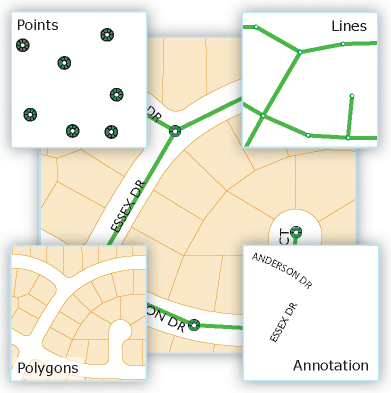
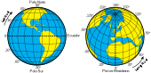

[RA3](../tags.md#tag:ra3)
[SQL](../tags.md#tag:sql)

# Consultas jerárquicas sobre MariaDB

Los datos geoespaciales son aquellos que representan objetos o fenómenos que están asociados con una ubicación en la Tierra.



Elementos gesespaciales - arcgis.com

El uso de mapas y la relevancia de los datos por proximidad han propiciado la evolución de los datos geospaciales de sistemas específicos GIS (*Geographic Information System*) como *Oracle Spatial* hacia su existencia en la mayor de sistemas gestores de bases de datos, ya sea formando parte del propio núcleo o mediante una extensión, permitiendo el almacenamiento, manipulación y análisis de este tipo de datos.

En nuestro caso, nos vamos a centrar de modo general tanto en MariaDB como en MongoDB, sin dejar de lado PostGIS sobre PostgreSQL, el cual es el referente en el mercado.

Los SGBD actuales facilitan el uso de datos geoespaciales al ser compatibles con el estándar OpenGIS, así como dar soporte para índices espaciales R-Tree, obteniendo un rendimiento optimizado para consultas geoespaciales, mediante el soporte de amplio conjunto de funciones espaciales.

## Entidades

Los [elementos geoespaciales](https://mariadb.com/kb/en/geometry-types/) más importante son el punto, la línea y el polígono. En los siguientes apartados los estudiaremos en detalles, tanto su almacenamiento como procesamiento.

Todo ellos se basan en el uso de coordenadas, ya sean expresadas mediante `X` e `Y` (o `longitud` y `latitud`), donde los valores de longitud van desde `-180` hasta `180` (de Este a Oeste), mientras que los de latitud de `-90` a `90` (de Sur a Norte). El orden es muy importante ya que siempre se indican con `(X,Y)` o `[longitud, latitud]`.



Longitud y latitud - Wikipedia

### Punto

Representa una ubicación específica mediante coordenadas, por ejemplo, utilizando el tipo `POINT` en *MariaBD*.

A continuación, tenemos un ejemplo donde creamos una tabla con un campo de tipo `POINT` donde almacenamos las coordenadas de una determinada ubicación, y posteriormente insertamos registros utilizando la función [`POINT()`](https://mariadb.com/kb/en/point/) para su almacenamiento.

```
CREATE TABLE ubicaciones (
    id INT AUTO_INCREMENT PRIMARY KEY,
    nombre VARCHAR(100),
    coordenadas POINT NOT NULL
);

INSERT INTO ubicaciones (nombre, coordenadas) VALUES
    ('Ubicación A', POINT(40.7128, -74.0060)),
    ('Ubicación B', POINT(34.0522, -118.2437)),
    ('Ubicación C', POINT(51.5074, -0.1278));
```

En cambio, en *MongoDB* se expresan mediante un tipo `Point` donde se indican las coordenadas dentro de un array:

```
{
  type: "Point",
  coordinates: [-3.7038, 40.4168]  // Madrid
}
```

### Línea

Representa una secuencia de puntos conectados formando una línea, por ejemplo, utilizando el tipo `LINESTRING` en MariaBD

```
-- Creación de una línea
CREATE TABLE rutas (
    id INT AUTO_INCREMENT PRIMARY KEY,
    nombre VARCHAR(100),
    ruta LINESTRING NOT NULL
);

-- Insertar una línea
INSERT INTO rutas (nombre, ruta) 
VALUES ('Ruta 1', ST_LineStringFromText('LINESTRING(0 0, 10 10, 20 25)'));
```

En cambio, en *MongoDB* se expresan mediante un tipo `LineString` donde se indican las coordenadas dentro de un array:

```
{
  type: "LineString",
  coordinates: [
    [-3.7038, 40.4168],  // Madrid
    [-0.3763, 39.4699]   // Valencia
  ]
}
```

### Polígono

Representa un área cerrada definida por un anillo exterior y, opcionalmente, uno o más anillos interiores que definen "agujeros".

El primer array define el perímetro exterior, los siguientes definen agujeros internos.

mediante el tipo `POLYGON` en MariaBD

```
-- Creación de un polígono
CREATE TABLE terrenos (
    id INT AUTO_INCREMENT PRIMARY KEY,
    nombre VARCHAR(100),
    area POLYGON NOT NULL
);

-- Insertar un polígono (cuadrado simple)
INSERT INTO terrenos (nombre, area) 
VALUES ('Parcela A', ST_PolygonFromText('POLYGON((0 0, 0 10, 10 10, 10 0, 0 0))'));
```

```
{
  type: "Polygon",
  coordinates: [[
    [-3.8, 40.3],
    [-3.6, 40.3],
    [-3.6, 40.5],
    [-3.8, 40.5],
    [-3.8, 40.3]  // Debe cerrar el polígono
  ]]
}
```

Tipos compuestos

Otros tipos compuestos son:

- MULTIPOINT: Almacena una colección de puntos.
- MULTILINESTRING: Almacena una colección de objetos LineString.
- MULTIPOLYGON: Una superficie formada por una o más líneas cerradas. Almacena una colección de polígonos.
- GEOMETRYCOLLECTION: Colección de diferentes tipos de geometrías.
- GEOMETRY: almacena valores de cualquier tipo.

## Operaciones

## Consultas geoespaciales en MariaDB

## Consultas geoespaciales en MongoDB

## Optimización

Indexar Datos Espaciales

Es recomendable crear un `SPATIAL INDEX` (índices espaciales) para campos espaciales, ya que mejora el rendimiento de las consultas geoespaciales. Sin embargo, estos índices tienen limitaciones, como que solo funcionan con tablas de tipo MyISAM o InnoDB (en versiones recientes). Ejemplo:

```
-- Campo nombre y coordenadas tienen que estar a not null
CREATE SPATIAL INDEX idx_coordenadas ON ubicaciones (coordenadas);
```

Esto puede mejorar significativamente el rendimiento de las consultas espaciales.

[](https://ko-fi.com/T6T8GWT9N "Invítame a un café en ko-fi.com")

Gracias por tu tiempo. Si quieres me puedes [invitar a un café en ko-fi](https://ko-fi.com/T6T8GWT9N).

¡Gracias por tu colaboración! Ayúdame a mejorar los apuntes enviándome un mail a [a.medrano@edu.gva.es](mailto:a.medrano@edu.gva.es) con tus comentarios.
