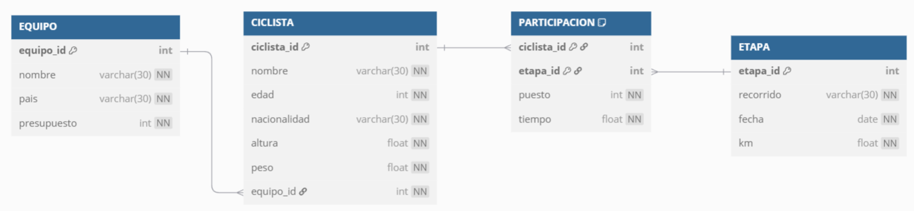

[SQL](../tags.md#tag:sql)

# Supuestos completos

## CyL24 - Ciclismo

En una famosa comarca de Castilla y León se celebra todos los años en torno al verano una vuelta ciclista no profesional de cinco etapas. Participan media docena de equipos con un máximo de 10 ciclistas en cada uno.

Entre los objetivos de todos los ciclistas siempre está el poder llegar hasta la última etapa, aunque las caídas y otro tipo de incidentes provocan que algunos ciclistas tengan que abandonar antes de llegar a la meta.

En una base de datos, se dispone de las siguientes tablas:

- `EQUIPO`

  | Columna | Tipo | Restricciones |
  | --- | --- | --- |
  | `equipo_id` | NUMBER | **PK**L |
  | `nombre` | VARCHAR2(30) | NOT NULL |
  | `pais` | VARCHAR2(30) | NOT NULL |
  | `presupuesto` | NUMBER | NOT NULL |
- `CICLISTA`

  | Columna | Tipo | Restricciones |
  | --- | --- | --- |
  | `ciclista_id` | NUMBER | **PK** |
  | `nombre` | VARCHAR2(30) | NOT NULL |
  | `edad` | NUMBER | NOT NULL |
  | `nacionalidad` | VARCHAR2(30) | NOT NULL |
  | `altura` | NUMBER | NOT NULL |
  | `peso` | NUMBER | NOT NULL |
  | `equipo_id` | NUMBER | **FK**, NOT NULL |
- `ETAPA`

  | Columna | Tipo | Restricciones |
  | --- | --- | --- |
  | etapa\_id | NUMBER | **PK** |
  | recorrido | VARCHAR2(30) | NOT NULL |
  | fecha | DATE | NOT NULL |
  | km | NUMBER | NOT NULL |
- `PARTICIPACION`

  | Columna | Tipo | Restricciones |
  | --- | --- | --- |
  | ciclista\_id | NUMBER | **PK**, **FK** |
  | etapa\_id | NUMBER | **PK**, **FK** |
  | puesto | NUMBER | NOT NULL |
  | tiempo | NUMBER | NOT NULL |

### Enunciado

1. Mostrar mediante una sola consulta SQL el nombre de los ciclistas que, al menos en dos etapas hayan conseguido un puesto 1, 2 o 3. En la consulta debe aparecer ordenada por puesto la siguiente información: nombre, puesto y número de veces que han conseguido dicho puesto.
2. Mostrar mediante una sola consulta SQL, el nombre y la edad de los ciclistas, junto a un DATO que indicará:

   - `>PESO` cuando el peso del ciclista supere la media del peso de los ciclistas de su equipo.
   - `<ALTURA` cuando la altura del ciclista sea inferior a media de la altura de los ciclistas de su misma edad.
3. Teniendo en cuenta que cuando un ciclista no finaliza una etapa se le pone un 0 en el campo PUESTO de la tabla `PARTICIPACION`, crear una función que reciba como parámetro un identificador de ciclista y devuelva la suma de kms de las etapas que ha finalizado, siempre que no sea la última en la que ha participado. (Es obligatorio crear también el bloque PL/SQL para probar la función).
4. Mediante una única sentencia, crea la tabla `CLASIFICACION` que contenga los campos `CICLISTA_ID` y `PUNTOS` e inserta tantos registros como ciclistas participan en la vuelta.

   A continuación, convierte el campo `CICLISTA_ID` en clave primaria
5. Crear un procedimiento actualizado para actualizar el campo `PUNTOS` de la tabla anterior, con los puntos que les corresponden a los ciclistas según los puestos obtenidos en las etapas en las que han participado (tabla `PARTICIPACION`).

   En función de la posición lograda en cada etapa, obtendrán los siguientes puntos:

   - 1ª posición: 30 puntos.
   - 2ª posición: 20 puntos.
   - 3ª posición: 10 puntos.
6. Crear una tabla llamada `AUDITORIA` con una única columna con nombre `INFO` tipo `VARCHAR(100)`. A continuación, se pide crear un disparador llamado `D_CLASIFICACION` para auditar la inserción, modificación y borrado en la tabla `CLASIFICACION`, insertando un mensaje en la tabla `AUDITORIA` en función de la operación realizada.

   - Si se inserta, el mensaje incluirá: `INSERCIÓN`, fecha, identificador del ciclista y puntos.
   - Si se modifica, el mensaje incluirá `MODIFICACIÓN`, fecha, nombre e identificación del ciclista, puntos anteriores y puntos finales.
   - Si se borra, el mensaje incluirá: `BORRADO`, fecha, identificador del ciclista y puntos.

### Solución

El primer paso es realizar un diagrama que nos permite visualizar las relaciones entre las diferentes tablas. Para ello emplearemos la sintaxis de DBML:

cyl24.dbml

```
Table EQUIPO {
  equipo_id     int     [pk]
  nombre        varchar(30) [not null]
  pais          varchar(30) [not null]
  presupuesto   int     [not null]
}

Table CICLISTA {
  ciclista_id    int     [pk]
  nombre         varchar(30) [not null]
  edad           int     [not null]
  nacionalidad   varchar(30) [not null]
  altura         float   [not null]
  peso           float   [not null]
  equipo_id      int     [not null, ref: > EQUIPO.equipo_id]
}

Table ETAPA {
  etapa_id     int     [pk]
  recorrido    varchar(30) [not null]
  fecha        date    [not null]
  km           float   [not null]
}

Table PARTICIPACION {
  ciclista_id   int     [pk, ref: > CICLISTA.ciclista_id]
  etapa_id      int     [pk, ref: > ETAPA.etapa_id]
  puesto        int     [not null]
  tiempo        float   [not null]
}
```

Obteniendo el siguiente diagrama mediante <https://dbdiagram.io/>:



Diagrama CyL24

A continuación, procedemos a solucionar las diferentes consultas.

1. Para mostrar el nombre de los ciclistas que hayan quedado al menos **dos veces** en los puestos **1, 2 o 3**, junto con el **puesto** y el **número de veces** que han conseguido ese puesto, y que la salida estará ordenada por puesto, necesitamos realizar un *join* entre ciclista y participación y para que el puesto sea uno de los indicados. Luego, tras agrupar, filtrar para que haya dos instancias de dichos ciclistas:

   ```
   SELECT 
       C.nombre,
       P.puesto,
       COUNT(*) AS veces
   FROM 
       PARTICIPACION P
   JOIN 
       CICLISTA C ON C.ciclista_id = P.ciclista_id
   WHERE 
       P.puesto IN (1, 2, 3)
   GROUP BY 
       C.nombre, P.puesto
   HAVING 
       COUNT(*) >= 2
   ORDER BY 
       P.puesto;
   ```

   De esta manera obtendríamos un resultado similar a :

   | nombre | puesto | veces |
   | --- | --- | --- |
   | Luis Gómez | 1 | 3 |
   | Pedro Ruiz | 2 | 2 |
   | Ana Torres | 3 | 4 |

   Pero como nos pide que hayan quedado al menos **dos veces** en los puestos **1, 2 o 3**, necesitamos quitar el puesto de la agregación:

   ```
   SELECT 
       C.nombre,
       COUNT(*) AS veces_en_podio
   FROM 
       PARTICIPACION P
   JOIN 
       CICLISTA C ON C.ciclista_id = P.ciclista_id
   WHERE 
       P.puesto IN (1, 2, 3)
   GROUP BY 
       C.nombre
   HAVING 
       COUNT(*) >= 2
   ORDER BY 
       veces_en_podio DESC;
   ```

   Y ahora sí que obtenemos el resultado esperado:

   | nombre | veces\_en\_podio |
   | --- | --- |
   | Ana Torres | 5 |
   | Luis Gómez | 3 |
   | Pedro Ruiz | 2 |

   Finalmente, si queremos obtener el desglose de podios por tipo de puesto, podemos usar la variante con `SUM(CASE...)`:

   ```
   SELECT 
       C.nombre,
       SUM(CASE WHEN P.puesto = 1 THEN 1 ELSE 0 END) AS primeros,
       SUM(CASE WHEN P.puesto = 2 THEN 1 ELSE 0 END) AS segundos,
       SUM(CASE WHEN P.puesto = 3 THEN 1 ELSE 0 END) AS terceros,
       COUNT(*) AS total_podios
   FROM 
       PARTICIPACION P
   JOIN 
       CICLISTA C ON C.ciclista_id = P.ciclista_id
   WHERE 
       P.puesto IN (1, 2, 3)
   GROUP BY 
       C.nombre
   HAVING 
       COUNT(*) >= 2
   ORDER BY 
       total_podios DESC;
   ```

   Obteniendo:

   | nombre | primeros | segundos | terceros | total\_podios |
   | --- | --- | --- | --- | --- |
   | Ana Torres | 2 | 1 | 2 | 5 |
   | Luis Gómez | 1 | 1 | 1 | 3 |
   | Pedro Ruiz | 0 | 2 | 0 | 2 |
2. En la segunda consulta, que solicita recuperar para cada ciclista su **nombre**, **edad** y un campo adicional llamado **DATO**, que indique:

   - `' >PESO'` si su **peso** es mayor que la media de su equipo.
   - `' <ALTURA'` si su **altura** es menor que la media de los ciclistas de su **misma edad**.
   - Si no se cumple ninguna de las dos condiciones, ese campo debe quedar vacío o nulo.

   Como solo se puede mostrar **una condición**, y hay que priorizar `>PESO` sobre `<ALTURA`, usaremos `CASE` en una única consulta, de manera que se evalúa primero el `>PESO`, y solo si no se cumple se evalúa `<ALTURA`. Además, necesitaremos utilizar subconsultas correlacionadas para calcular los valores medios:

   ```
   SELECT
       c.nombre,
       c.edad,
       CASE
           WHEN c.peso > (
               SELECT AVG(c2.peso) -- calcula el peso medio de los compañeros de equipo.
               FROM CICLISTA c2
               WHERE c2.equipo_id = c.equipo_id
           ) THEN '>PESO'
           WHEN c.altura < (
               SELECT AVG(c3.altura) -- calcula la altura media de los ciclistas de la misma edad.
               FROM CICLISTA c3
               WHERE c3.edad = c.edad
           ) THEN '<ALTURA'
           ELSE NULL
       END AS dato
   FROM 
       ciclista c;
   ```

---

3. Teniendo en cuenta que cuando un ciclista no finaliza una etapa se le pone un 0 en el campo `PUESTO` de la tabla `PARTICIPACION`, crear una función que reciba como parámetro un identificador de ciclista y devuelva la suma de kms de las etapas que ha finalizado, siempre que no sea la última en la que ha participado.

   ```
   DELIMITER //

   CREATE FUNCTION kms_finalizados_sin_ultima(p_ciclista_id INT) RETURNS INT
   BEGIN
       DECLARE v_kms_total INT DEFAULT 0;
       DECLARE v_ultima_etapa_id INT;

       -- Obtener la última etapa (con mayor ID) en la que participó el ciclista
       SELECT MAX(etapa_id)
       INTO v_ultima_etapa_id
       FROM participacion
       WHERE ciclista_id = p_ciclista_id;

       -- Sumar los kms de las etapas finalizadas (puesto ≠ 0) y que no sean la última
       SELECT IFNULL(SUM(e.km), 0)
       INTO v_kms_total
       FROM participacion p
       JOIN etapa e ON p.etapa_id = e.etapa_id
       WHERE p.ciclista_id = p_ciclista_id
       AND p.puesto != 0
       AND p.etapa_id != v_ultima_etapa_id;

       RETURN v_kms_total;
   END //

   DELIMITER ;
   ```

DELIMITER //

CREATE FUNCTION kms\_finalizados\_anteriores(p\_ciclista\_id INT)
RETURNS DECIMAL(10,2)
DETERMINISTIC
BEGIN
DECLARE v\_kms DECIMAL(10,2) DEFAULT 0;

```
SELECT IFNULL(SUM(e.km), 0)
INTO v_kms
FROM PARTICIPACION p
JOIN ETAPA e ON p.etapa_id = e.etapa_id
WHERE p.ciclista_id = p_ciclista_id
  AND p.puesto != 0
  AND e.fecha < (
      SELECT MAX(e2.fecha)
      FROM PARTICIPACION p2
      JOIN ETAPA e2 ON p2.etapa_id = e2.etapa_id
      WHERE p2.ciclista_id = p_ciclista_id
  );

RETURN v_kms;
```

END;
//

DELIMITER ;

/

---

Para probar la función, podemos emplear la siguiente consulta:

```
SELECT kms_finalizados_sin_ultima(1) AS kms_resultado;
```

---

[](https://ko-fi.com/T6T8GWT9N "Invítame a un café en ko-fi.com")

Gracias por tu tiempo. Si quieres me puedes [invitar a un café en ko-fi](https://ko-fi.com/T6T8GWT9N).

¡Gracias por tu colaboración! Ayúdame a mejorar los apuntes enviándome un mail a [a.medrano@edu.gva.es](mailto:a.medrano@edu.gva.es) con tus comentarios.
